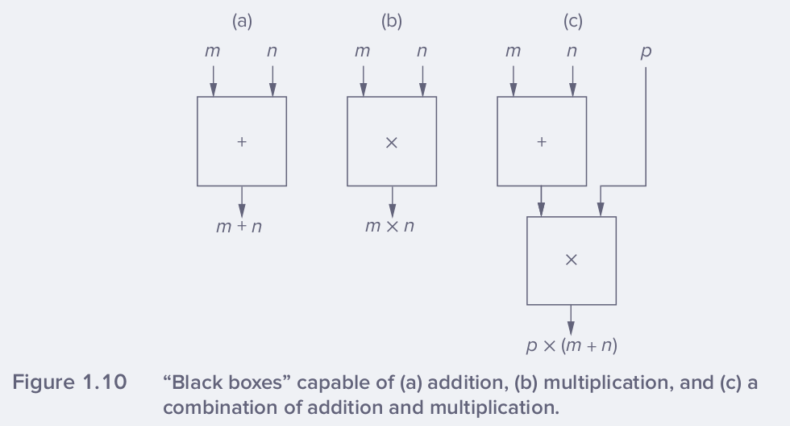
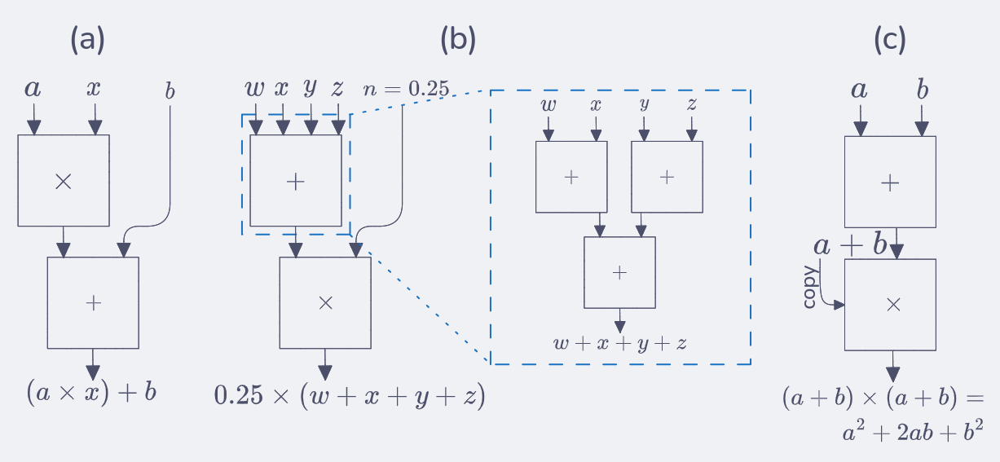
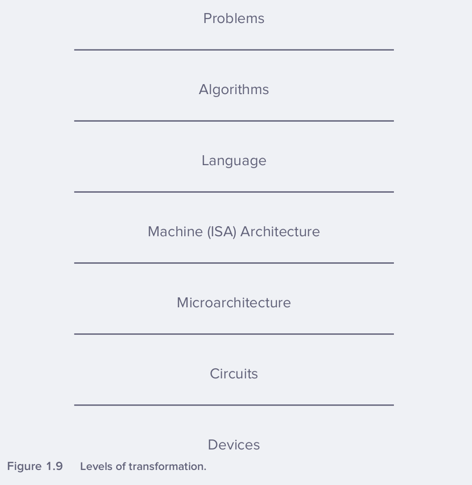

- **1.1** Explain the first of the two important ideas stated in Section 1.5.

*Ans.-* Important idea 1 states that a once a Turing complete computing system is achieved then it is capable of computing anything that is computable given enough resources ie. enough memory and time. So there is nothing that a less powerfull computer can't do that a super powerful computer can, given enough resources.

Idea 2 states that when using a computer to solve a problem we first describe it in human language and after some translation steps to the binary language that machines operate with, it is voltages and electrons that ultimetaly solve the problem.

---
- **1.2** Can a higher-level programming language instruct a computer to compute more than a lower-level programming language?

*Ans.-* No it cannot. Normally programming languages are Turing complete, so given enough time and resources both programming languages are capable of instructing the same computation. It is important to mention though that higher-level programming languages have limitations regarding their capability of instructing fine grained low-level computation tweaks. Normally higher-level programming languages operate many layers of abstraction above bare metal programming so its language abstractions detach their granularity capabilities whereas low-level languages allow closer manipulation of bare metal specifics.

---
- **1.3** What difficulty with analog computers encourages computer designers to use digital designs?

*Ans.-* Analog computers cannot become *universal computational devices* (Turing complete), they are not general-purpose. Moreover, it is very hard to improve their computation accuracy due to physical complications.

---
- **1.4** Name one characteristic of natural languages that prevents them from being used as programming languages.

*Ans.-* Natural languages are abstract and ambiguous which makes them bad choices to directly communicate instructions to computers. Computers can only be fed *algorithms* (step-by-step procedures) that have the following characteristics: *definitness* - each step is precisely stated; *effective  computability* - each step can be carried out by a computer and *finitness* - the procedure terminates.

---
- **1.5** Say we had a *“black box”*, which takes two numbers as input and outputs their sum. See Figure 1.10a. Say we had another box capable of multiplying two numbers together. See Figure 1.10b. We can connect these boxes together to calculate $p \times (m + n)$. See Figure 1.10c. Assume we have an unlimited number of these boxes. Show how to connect them together to calculate:
    - a. $ax + b$
    - b. The average of the four input numbers $w, x, y,$ and $z$
    - c. $a^2 + 2ab + b^2$ (Can you do it with one add box and one multiply box?)

*Ans.-* 

---
- **1.6** Write a statement in a natural language, and offer two different interpretations of that statement.

*Ans.-* The statement: *"I wear many hats at my job"* is a common phrase we might hear at work. It has least two interpretations: we can take the literal meaning that the person actually wears different phyisical hats or that the 'hat' is a metaphor for job-roles.

---
- **1.7** The discussion of abstraction in Section 1.3.1 noted that one does not need to understand the makeup of the components as long as “everything about the detail is just fine.” The case was made that when everything is not fine, one must be able to deconstruct the components, or be at the mercy of the abstractions. In the taxi example, suppose you did not understand the component, that is, you had no clue how to get to the airport. Using the notion of abstraction, you simply tell the driver, *“Take me to the airport.”* Explain when this is a productivity enhancer, and when it could result in very negative consequences.

*Ans.-* It is a productivity enhancer when you trust the driver can safely take you to your destination and none of the parties need to discuss the intricacies about how to get there. However, if neither individual knows how to get there it is a failed interaction ie. the driver might wander around the city without ever getting you to the airport and you could miss your flight.

---
- **1.8** John said, “I saw the man in the park with a telescope.” What did he mean? How many reasonable interpretations can you provide for this statement? List them. What property does this sentence demonstrate that makes it unacceptable as a statement in a program?

*Ans.-* We can interpret the sentence in a bunch of ways. (1) The observer used a telescope with which he saw a man in a park. (2) The observer saw (perhaps with naked eye) a man in the park who was manipulating telescope. (3) the name "the man in the park" could be an alias to a specific individual who was seen in no real physical park in this particular situation.

---
- **1.9** Are natural languages capable of expressing algorithms?

*Ans.-* Yes, the universe of what can be expressed with natural languages encompasses what can be expressed with computer languages (which are not ambiguous). If it would be otherwise science and this very same book couldn't exist. The caveat is that we have to make a great extra effort to accurately describe technical specifications or concepts with natral languages.

---
- **1.10** Name three characteristics of algorithms. Briefly explain each of these three characteristics.

*Ans.-* *Definitness* - notion that each step in the algorithm is precisely stated. *Effective computability* - all steps specified can be carried out by a computer system. *Finitness* - the algorithm/procedure ends aka. is finite.

---
- **1.11** For each characteristic of an algorithm, give an example of a procedure that does not have the characteristic and is therefore not an algorithm.

*Ans.-* 
| Characteristic | Counterexample | 
|----------------|----------------|
| Definitness | A cooking recipe that says "add salt to taste" - we cannot know how much salt is appropriate "to taste" |
| Effective computability | Find the largest real number or largest prime number. | 
| Finitness | Any infinite loop like `int n = 2; while (n % 2 == 0) { printf("%d is even", n); n += 2 }` |

---
- **1.12** Are items a through e in the following list algorithms? If not, what qualities required of algorithms do they lack?
    - a. Add the first row of the following matrix to another row whose first column contains a non-zero entry. (Reminder: Columns run vertically; rows run horizontally.)$$
\begin{bmatrix}
1 & 2 & 0 & 4 \\
0 & 3 & 2 & 4 \\
2 & 3 & 10 & 22 \\
12 & 4 & 3 & 4
\end{bmatrix}$$
    - b. In order to show that there are as many prime numbers as there are natural numbers, match each prime number with a natural number in the following manner. Create pairs of prime and natural numbers by matching the first prime number with 1 (which is the first natural number) and the second prime number with 2, the third with 3, and so forth. If, in the end, it turns out that each prime number can be paired with each natural number, then it is shown that there are as many prime numbers as natural numbers.
    - c. Suppose you’re given two vectors each with 20 elements and asked to perform the following operation: Take the first element of the first vector and multiply it by the first element of the second vector. Do the same to the second elements, and so forth. Add all the individual products together to derive the dot product.
    - d. Lynne and Calvin are trying to decide who will take the dog for a walk. Lynne suggests that they flip a coin and pulls a quarter out of her pocket. Calvin does not trust Lynne and suspects that the quarter may be weighted (meaning that it might favor a particular outcome when tossed) and suggests the following procedure to fairly determine who will walk the dog.
        - 1. Flip the quarter twice.
        - 2. If the outcome is heads on the first flip and tails on the second, then I will walk the dog.
        - 3. If the outcome is tails on the first flip and heads on the second, then you will walk the dog.
        - 4. If both outcomes are tails or both outcomes are heads, then we flip twice again. Is Calvin’s technique an algorithm?
    - e. Given a number, perform the following steps in order:
        - 1. Multiply it by 4
        - 2. Add 4
        - 3. Divide by 2
        - 4. Subtract 2
        - 5. Divide by 2
        - 6. Subtract 1
        - 7. At this point, add 1 to a counter to keep track of the fact that you performed steps 1 through 6. Then test the result you got when you subtracted 1. If 0, write down the number of times you performed steps 1 through 6 and stop. If not 0, starting with the result of subtracting one, perform the seven steps again.

*Ans.-* 

- a. Could be classified as not an algorithm because the instruction of adding the 1st row + "another" row (whose fst column contains a non-zero entry) is not specific enough ie. lacks definitness. There are many rows w/o a zero as its first element eg. 1st, 3rd, 4th and "another" doesn't specify how to pick among these candidates.
- b. Not an algorithm, it lacks finitness ie. we'll be able to infinetly find a subsequent prime number paired with a natural number $\mathbb{N}$.
- c. Yes, it is a well known algorithm as a matter of fact.
- d. Yes, Calvin's procedure is an algorithm. However, there is a posibility that it will never end if the coin is weighted to the point that it will produce the same result 100% of the times.
- e. Steps 1-6: $n\rightarrow \left((4n+4)/2-2\right)/2-1$ simplify to: $n\rightarrow n-1$ so the only ambiguity is if the input number $n$ is a natural, real or complex number? The instructions are an algorithm only if $n\in \mathbb{N}$, otherwise the instructions lead to violating finitness.

---

- **1.13** Two computers, A and B, are identical except for the fact that A has a subtract instruction and B does not. Both have add instructions. Both have instructions that can take a value and produce the negative of that value. Which computer is able to solve more problems, A or B? Prove your result.

*Ans.-* Both computers A & B are equally capable because they both have sign inversion instructions so they are equivalent ie. both can perform `ADD(X0,X1)` whereas A can perform `SUBSTRACT(X0,X1)` and B cannot, but the latter can perform `ADD(X0,(-X1))` which is equivalent to substraction.

---

- **1.14** Suppose we wish to put a set of names in alphabetical order. We call the act of doing so sorting. One algorithm that can accomplish that is called the bubble sort. We could then program our bubble sort algorithm in C and compile the C program to execute on an x86 ISA. The x86 ISA can be implemented with an Intel Pentium IV microarchitecture. Let us call the sequence “Bubble Sort, C program, x86 ISA, Pentium IV microarchitecture” one transformation process. Assume we have available four sorting algorithms and can program in C, C++, Pascal, Fortran, and COBOL. We have available compilers that can translate from each of these to either x86 or SPARC, and we have available three different microarchitectures for x86 and three different microarchitectures for SPARC.
    - a. How many transformation processes are possible?
    - b. Write three examples of transformation processes.
    - c. How many transformation processes are possible if instead of three different microarchitectures for x86 and three different microarchitectures for SPARC, there were two for x86 and four for SPARC?

*Ans.-* 

- a. It reduces to a combinatorics problem where we have 4 sorting algorithms $(A=4)$, five programming languages $(P=5)$, compilers for its respective programming language that can target two ISAs $(C_{\text{x86}}=1, C_{\text{SPARC}}=1)$ and three different microarchitectures for each ISA $(M_{\text{x86}}=3, M_{\text{SPARC}}=3)$. So the total number of possible transformation processes is: $A\times P \times (C_{\text{x86}} \times M_{\text{x86}} + C_{\text{SPARC}} \times M_{\text{SPARC}}) = 120$
- b. *(i)* Bubble Sort, Fortran program, x86 ISA Pentium IV microarchitecture. *(ii)* Merge Sort, COBOL program, x86 ISA, Pentium IV microarchitecture. *(iii)* Bubble Sort, C ptrogram, SPARC, UltraSPARC microarchitecture.
- c. In this case we have $M_{\text{x86}}=2, M_{\text{SPARC}}=4$ but we still have $120$ possible processes.

---

- **1.15** Identify one advantage of programming in a higher-level language compared to a lower-level language. Identify one disadvantage.

*Ans.-* Higher-level pograming languages allow to write feature-rich programs faster with less instructions thanks to the rich libraries and packages typically available within their ecosystems. This is one advantage of abstraction that high-level programming lanugages benefit from. One disadvantage of their abstraction is that fine granularity to manipulate low-level systems is hidden or often inaccessible.

---

- **1.16** Name at least three things specified by an ISA.

*Ans.-* The opcode, operands, data types and addressing modes.

---

- **1.17** Briefly describe the difference between an ISA and a microarchitecture.

*Ans.-* The ISA is a set of instructions that specifies how to give instructions to a computer and how the computer can carry-on those instructions. Whereas the microarchitecture is the way that a given ISA is implemented in a processor making sure that the underlying hardware architecture is compatible with understanding and executing all instructions.

---

- **1.18** How many ISAs are normally implemented by a single microarchitecture? Conversely, how many microarchitectures could exist for a single ISA?

*Ans.-* Only one ISA is normally implemented by a single microarchitecture whereas there could be many microarchitectures for a single ISA. For example, the ISA x86 microprocessor can be implemented by different processors' manufacturers throughout the years.

---

- **1.19** List the levels of transformation and name an example for each level.

*Ans.-* 

| Transformation | Example |
|---|---|
| Problems $\rightarrow$ Algorithms | Humans make this translation. They understand the problem and formulate the algorithms to solve it, mostly thinking in terms of natural language. |
| Algorithms $\rightarrow$ Language | Humans also perform this translation by writing the algorithms in code. |
| Language $\rightarrow$ ISA | The language compiler performs this translation from programming language to its corresponding ISA assembly. |
| ISA $\rightarrow$ Microarchitecture | Chip architects design the microarchitecture specification that will implement a particular ISA. |
| Microarchitecture $\rightarrow$ Cicuits | Circuit designers translate the microarchitecture blocks into actual logic gates and transistor arrangements. |
| Circuits $\rightarrow$ Device | Physics takes care of this connection. Where we trust in the circuitry and transistors to perform currents and voltage switches in such a way that they are suitable for computing stuff. |

---

- **1.20** The levels of transformation in Figure 1.9 are often referred to as levels of abstraction. Is that a reasonable characterization? If yes, give an example. If no, why not?

*Ans.-* Yes it is a reasonable characterization. We can refer to Problem 1.19 where we worked out all these translation steps. An example would be trying to sort a list of guests' surnames for an event in alphabetical order. 

| Transformation | Action |
|---|---|
| Problems $\rightarrow$ Algorithms | We already stated the problem in English now we posit a solution thinking in terms of algorithms (eg. Timsort). |
| Algorithms $\rightarrow$ Language | Write the algorithm in a programming language like C. |
| Language $\rightarrow$ ISA | Compile our code with the gcc compiler targeting x86 ISA 64bit, for example. |
| ISA $\rightarrow$ Microarchitecture | The specific microarchitecture design eg. the 13th Gen Intel Core i9-13900H implements the x86 ISA. |
| Microarchitecture $\rightarrow$ Cicuits | The ALU block in the microarchitecture becomes thousands of physical transistors arranged as logic gates (AND, OR, XOR, etc.). |
| Circuits $\rightarrow$ Device | Physics in the hardware solves our problem ie. voltages and electrons perform computations. |

---

- **1.21** Say you go to the store and buy some word processing software. What form is the software actually in? Is it in a high-level programming language? Is it in assembly language? Is it in the ISA of the computer on which you’ll run it? Justify your answer.

*Ans.-* When you buy software you actually get compiled machine code for the specific ISA of your computer. The actual software is an application that is an executable binary that has already been compiled from high-level languages down to ISA.

---

- **1.22** Suppose you were given a task at one of the transformation levels shown in Figure 1.9, and required to transform it to the level just below. At which level would it be most difficult to perform the transformation to the next lower level? Why?

*Ans.-* The most difficult transformation is definetly the first one - *Problems to Algorithms*. Because this is step comprises the real difficutly of how we can solve any problem with a Turing complete machine. So the range of problems that can be presented as computational problems are almost unbounded eg. from solving Artificial General Intelligence to solving High Performance Computing to solving Biology problems to even solving how to create better computers.

---

- **1.23** Why is an ISA unlikely to change between successive generations of microarchitectures that implement it? For example, why would Intel want to make certain that the ISA implemented by the Pentium III is the same as the one implemented by the Pentium II? Hint: When you upgrade your computer (or buy one with a newer CPU), do you need to throw out all your old software?

*Ans.-* The ISA is unlikely to change because of backwards compatibility - old software must run on new michroarchitectures. While ISAs do evolve they extend their instructions set making it a superset thus, preventing a disastrous invalidation of the entire older software ecosystem.

---

