- 3.1 In the following table, write whether each type of transistor will act as an open circuit or a closed circuit.

*Ans.-*
$$
\begin{array}{c|cc}
 & \text{N-type} & \text{P-type} \\
\hline
\text{Gate}=1 & \text{closed} & \text{open} \\
\text{Gate}=0 & \text{open} & \text{closed} 
\end{array}
$$

---

- 3.3 A two-input AND and a two-input OR are both examples of two-input logic functions. How many different two-input logic functions are possible?

*Ans.-* Using combinatorics, the number of logic functions match the number of unique output-bit combinations (4 per gate in our case) so with 2 gates (two-input AND & OR) the number of possible logic functions is $2^4=16$

---

- 3.5 Complete a truth table for the transistor-level circuit in Figure 3.37.

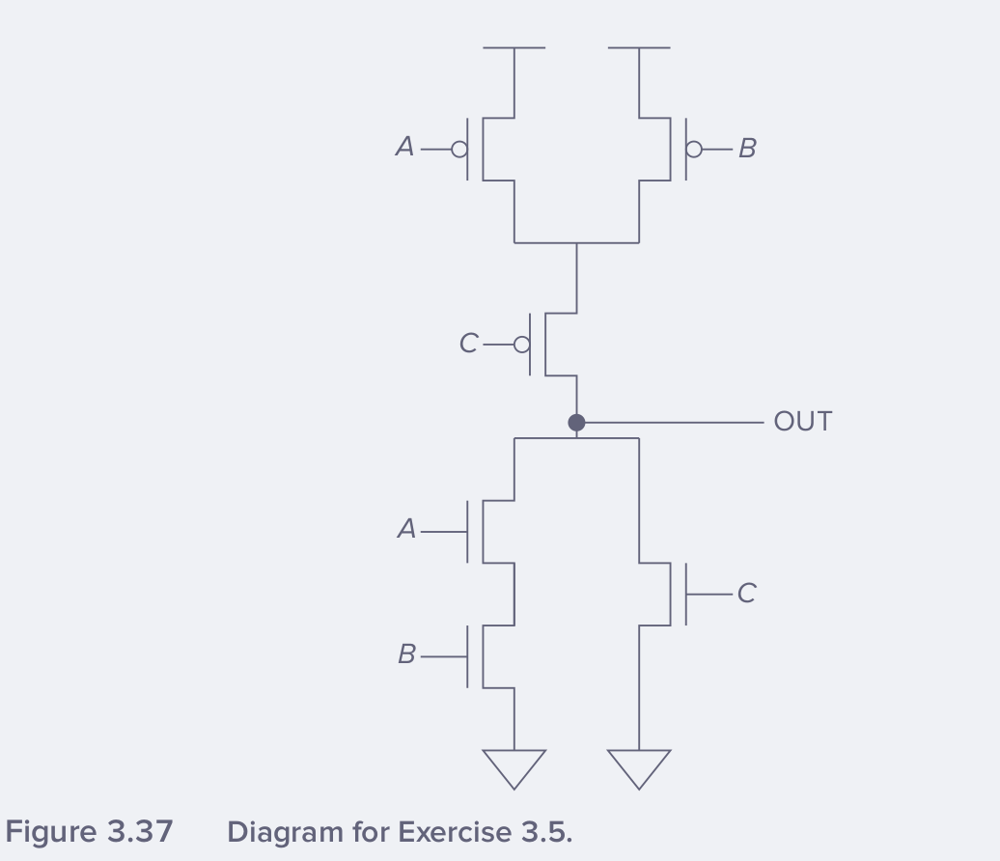

*Ans.-* We can quickly fill some outputs considering that if voltage on C's P-type gate is 1 then the circuit above OUT is open so 0. Also if the N-types A and B are supplied with voltage 1 our circuit is grounded
$$
\begin{array}{ccc|c}
A & B & C & \text{OUT} \\
\hline
0 & 0 & 0 & 1 \\
0 & 0 & 1 & 0 \\
0 & 1 & 0 & 1 \\
0 & 1 & 1 & 0 \\
1 & 0 & 0 & 1 \\
1 & 0 & 1 & 0 \\
1 & 1 & 0 & 0 \\
1 & 1 & 1 & 0 
\end{array}
$$

---

- 3.7 The following circuit has a major flaw. Can you identify it? Hint: Evaluate the circuit for all sets of inputs.

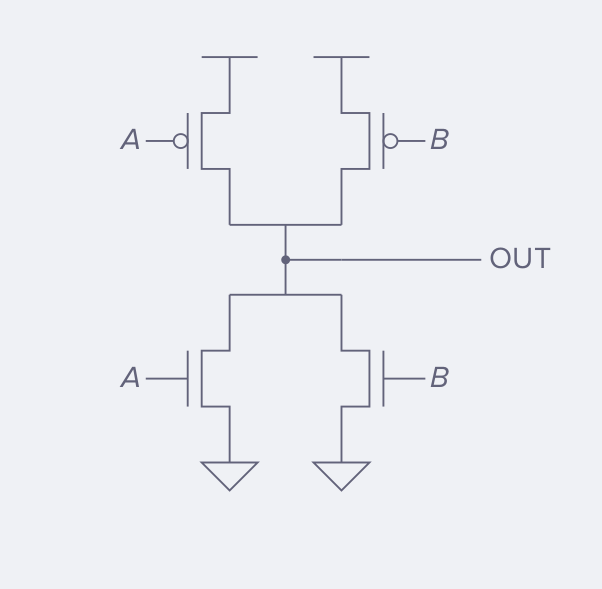

*Ans.-* The circuit breaks the complementary rule ie. two parallel P-type transistors must be connected to their N-type transistors in series and vice versa. This causes that for opposing $A,B$ input states we get a *short circuit* and has a useless undetermined $V_{\text{OUT}}$ voltage as we can see in the truth table.
$$
\begin{array}{cc|c}
A & B & \text{OUT} \\
\hline
0 & 0 & 1 \\
0 & 1 & 0< V_{\text{OUT}}< V_{DD} \\
1 & 0 & 0< V_{\text{OUT}}< V_{DD} \\
1 & 1 & 0
\end{array}
$$

---

- 3.9 What does the following transistor circuit do?

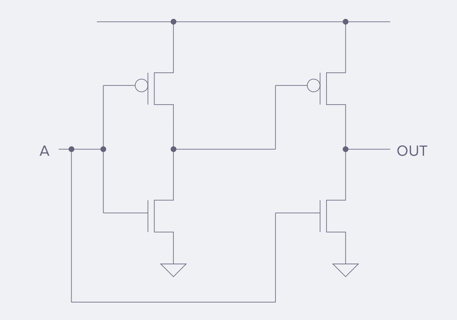

*Ans.-* When $A=0$ the circuit is inactive but when $A=1$ we have short circuit on the left causing $V_{\text{OUT}}$ to be undetermined.

---

- 3.11 A student knew that an inverter contained one P-type transistor and one N-type transistor, but he wired them up wrong, as shown below.

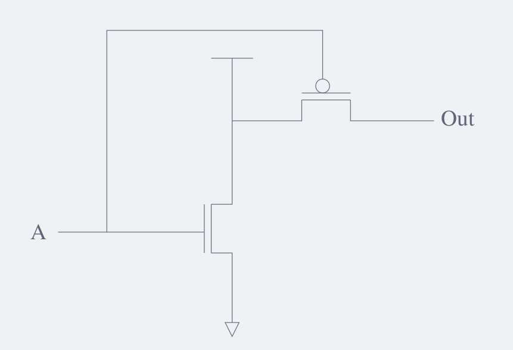

What is the value of Out when $A = 0$?
What is the value of Out when $A = 1$?

*Ans.-* The student did a critical mistake. An inverter consists of a PMOS and NMOS connected in series not in parllel. In this circuit when $A=0\rightarrow V_{\text{OUT}}\approx V_{DD}=3.3 V$ but when $A=1$ we have a short circuit. 

---

- 3.13 The following logic diagram produces the logical value OUT.

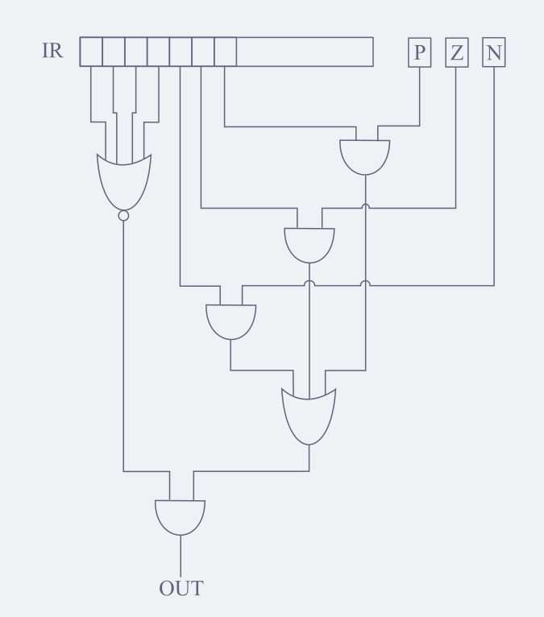

What does the value 0 or 1 for OUT signify?

> [!bug] Problem belongs to Chapter 5 (see Errata)

---

- 3.15 Fill in the truth table for the logical expression `NOT(NOT(A) OR NOT(B))`. What single logic gate has the same truth table?

*Ans.-* Its equivalent to the AND logical gate.
$$
\begin{array}{cc|c}
A & B & \text{NOT(NOT(A) OR NOT(B))} \\
\hline
0 & 0 & 0 \\
0 & 1 & 0 \\
1 & 0 & 0 \\
1 & 1 & 1 \\
\end{array}
$$

---

- 3.17 
    - a. Draw a transistor-level diagram for a three-input AND gate and a three-input OR gate. Do this by extending the designs from Figure 3.6a and 3.7a.
    - b. Replace the transistors in your diagrams from part a with either a wire or no wire to reflect the circuit’s operation when the following inputs are applied.
$$
\begin{align*}
\text{(1) } A = 1, B = 0, C = 0 \\
\text{(2) } A = 0, B = 0, C = 0 \\
\text{(3) } A = 1, B = 1, C = 1
\end{align*}
$$

*Ans.-* 

- a. 

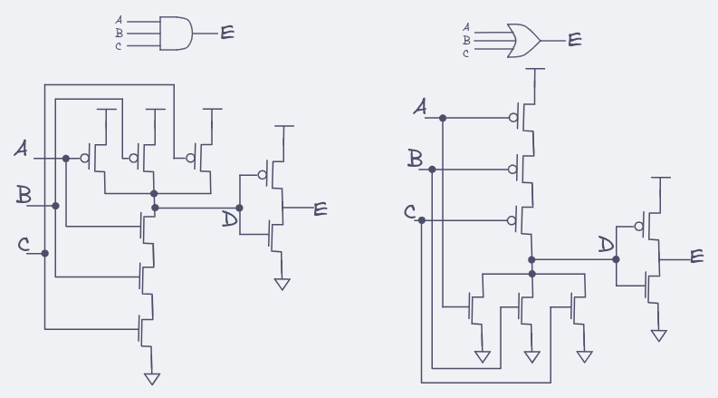

- b.

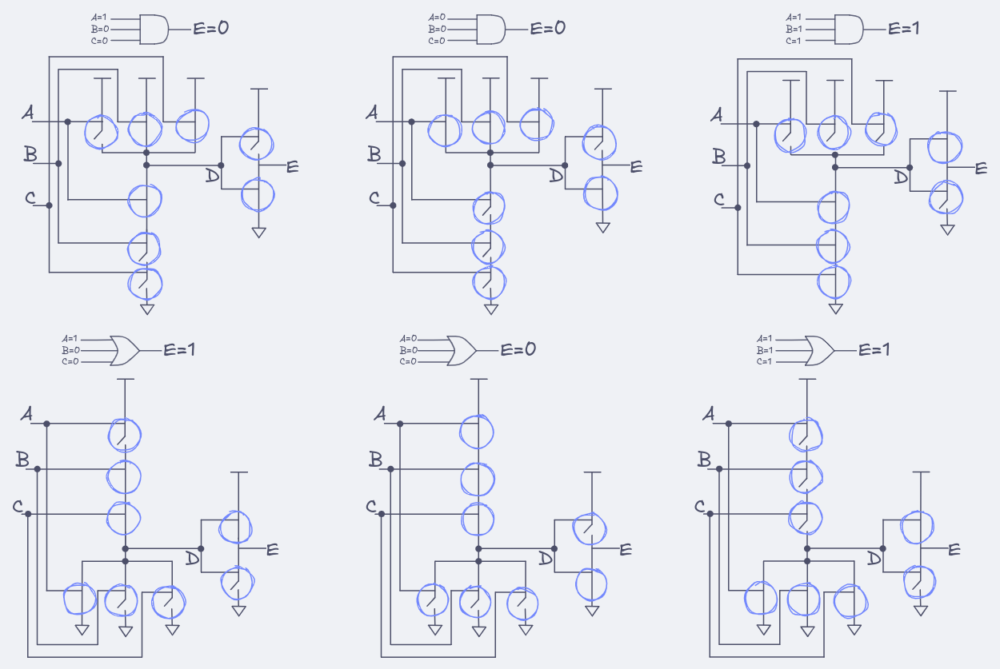

---

- 3.19 How many output lines will a five-input decoder have?

*Ans.-* $2^5=32$ outputs.

---

- 3.21 If $A$ and $B$ are four-bit unsigned binary numbers, `0111` and `1011`, complete the table obtained when using a two-bit full adder from Figure 3.15 to calculate each bit of the sum, $S$, of $A$ and $B$. Check your answer by adding the decimal value of $A$ and $B$ and comparing the sum with $S$. Are the answers the same? Why or why not?

*Ans.-* We will get an overflow because we're adding $7 + 11 = 18 = 0010_2$ which is out of range for a 4-bit number $[0,15]$. The overflow will be taken into account in the carry out of the MSB (*most significant bit*) ie. leftmost $C_{\text{out}}=1$ value in our table (boxed `1`).
$$
\begin{array}{lcccc}
C_{\text{in}} & 1 & 1 & 1 & 0 \\
\hline
A & 0 & 1 & 1 & 1 \\
B & 1 & 0 & 1 & 1 \\
S & 0 & 0 & 1 & 0 \\
C_{\text{out}} & \boxed{1} & 1 & 1 & 1 \\
\end{array}
$$

---

- 3.23 
    - a. Given four inputs $A, B, C$, and $D$ and one output $Z$, create a truth table for a circuit with at least seven input combinations generating `1`s at the output. (How many rows will this truth table have?)
    - b. Now that you have a truth table, generate the gate-level logic circuit
that implements this truth table. Use the implementation algorithm
referred to in Section 3.3.4.

*Ans.-*  Our truth table will have $2^4=16$ rows and for the gate-level circuit implementation we can choose any logic operation eg. NAND has plenty more than seven input combinations that yield `1` as the output.

- a.
$$
\begin{array}{cccc|c}
A & B & C & D & Z \\
\hline
0 & 0 & 0 & 0 & 1 \\
0 & 0 & 0 & 1 & 1 \\
0 & 0 & 1 & 0 & 1 \\
0 & 0 & 1 & 1 & 1 \\
0 & 1 & 0 & 0 & 1 \\
0 & 1 & 1 & 1 & 1 \\
0 & 1 & 1 & 0 & 1 \\
0 & 1 & 0 & 1 & 1 \\
1 & 0 & 1 & 0 & 1 \\
1 & 0 & 1 & 1 & 1 \\
1 & 0 & 0 & 0 & 1 \\
1 & 0 & 1 & 1 & 1 \\
1 & 1 & 1 & 0 & 1 \\
1 & 1 & 0 & 1 & 1 \\
1 & 1 & 1 & 0 & 1 \\
1 & 1 & 1 & 1 & 0 \\
\end{array}
$$

- b. Recall that in a *Programmable Array Logic* (PRL) the implementation algorithm is simply to connect the output of an AND gate to the input of an OR gate if the corresponding row of the turth table produces an output `1` for that column. So in our big NAND circuit below, 15 out of the 16 AND gate outputs should be connected to the OR gate except for the $A=B=C=D=1$ case (top AND gate) which responsible for the only `0` output.

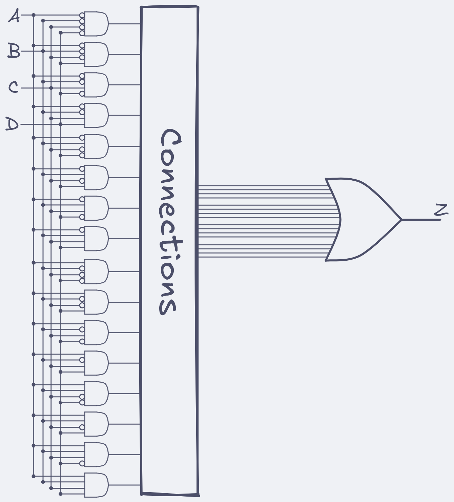

---

- 3.25 Logic circuit 1 in Figure 3.39 has inputs $A, B, C$. Logic circuit 2 in Figure 3.40 has inputs $A$ and $B$. Both logic circuits have an output $D$. There is a fundamental difference between the behavioral characteristics of these two circuits. What is it? Hint: What happens when the voltage at input $A$ goes from `0` to `1` in both circuits?

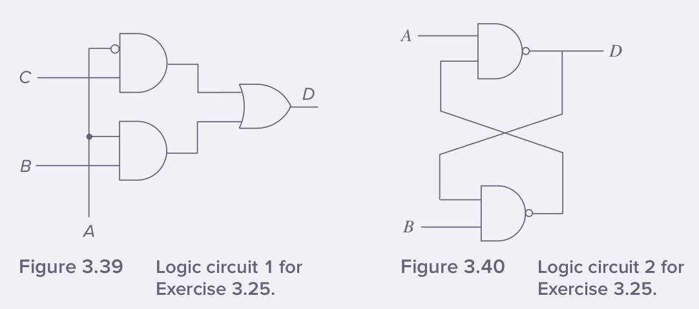

*Ans.-* Logic circuit 1 is a **mux** where $A$ acts as the select line . Whereas logic circuit 2 is simply an **R-S Latch** where $A$ sets ($B$ resets) the value of the latch-$D$ to `1` (`0`). Analyzing the case of the hint: *What happens when* $A:0\rightarrow 1$? - In circuit 1 the line selects `D = C` when `A = 0` and `D = B` when `A = 1`. In circuit 2 switching $A$ from `0` to `1` just sets and 'locks' the latch to `1`. 

---

- 3.27 You know a byte is eight bits. We call a four-bit quantity a nibble. If a byte-addressable memory has a 15-bit address, how many nibbles of storage are in this memory?

*Ans.-* A 14-bit, byte-addressable memory has $2^{14}=16384$ memory locations (each stores one byte or 8-bits or 2 nibbles). So we have $32768$ nibbles of storage.

---

- 3.29 Given the logic circuit in Figure 3.41, fill in the truth table for the output value $Z$.

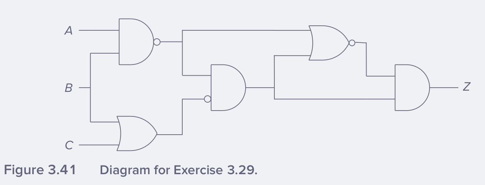

*Ans.-*

$$
\begin{array}{ccc|c}
A & B & C & Z \\
\hline
0 & 0 & 0 & 0 \\
0 & 0 & 1 & 0 \\
0 & 1 & 0 & 0 \\
0 & 1 & 1 & 0 \\
1 & 0 & 0 & 0 \\
1 & 0 & 1 & 0 \\
1 & 1 & 0 & 0 \\
1 & 1 & 1 & 0 \\
\end{array}
$$

---

- 3.31 Say the speed of a logic structure depends on the largest number of logic gates through which any of the inputs must propagate to reach an output. Assume that a NOT, an AND, and an OR gate all count as one gate delay. For example, the propagation delay for a two-input decoder shown in Figure 3.11 is 2 because some inputs propagate through two gates.
    - a. What is the propagation delay for the two-input mux shown in Figure 3.12?
    - b. What is the propagation delay for the one-bit full adder in Figure 3.15?
    - c. What is the propagation delay for the four-bit adder shown in Figure 3.16?
    - d. What if the four-bit adder were extended to 32 bits?

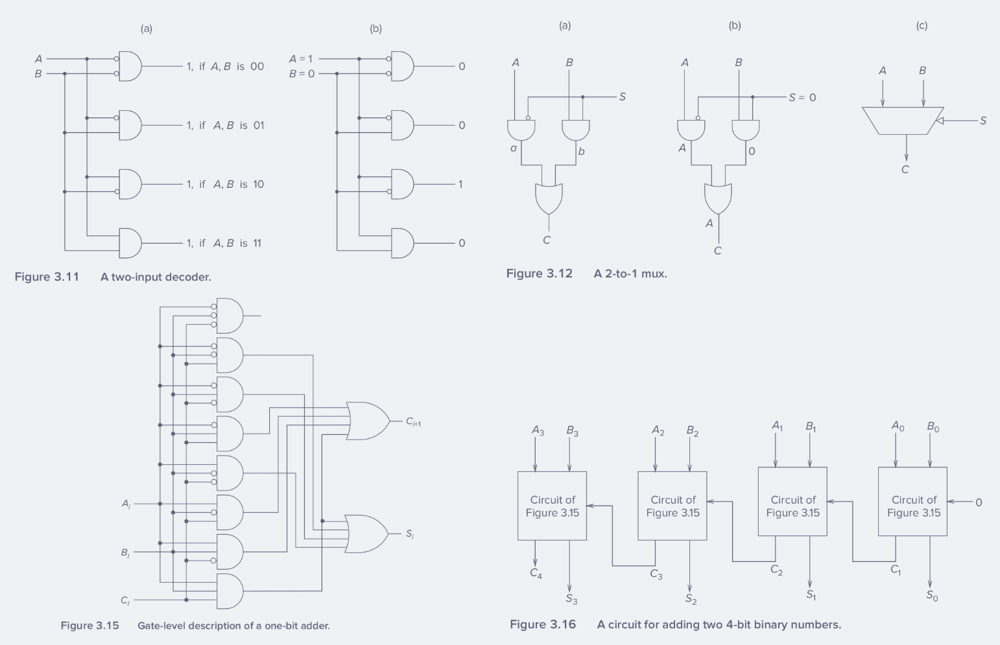

*Ans.-* The key notion to identify the propagation delay is the wording: "*LARGEST number of logic gates through which ANY of the inputs MUST propagate*".
- a. Figure 3.12: $3$ gate delays
- b. Figure 3.15: $3$ gate delays
- c. Figure 3.16: $3\times 4=12$ gate delays
- d. Figure 3.16 extended to 32-bit adder: $3\times 32=96$ gate delays

---

- 3.33 For this question, refer to the figure that follows.
    - a. Describe the output of this logic circuit when the select line $S$ is a logical `0`. That is, what is the output $Z$ for each value of $A$?
    - b. If the select line S is switched from a logical `0` to `1`, what will the output be?
    - c. Is this logic circuit a storage element?

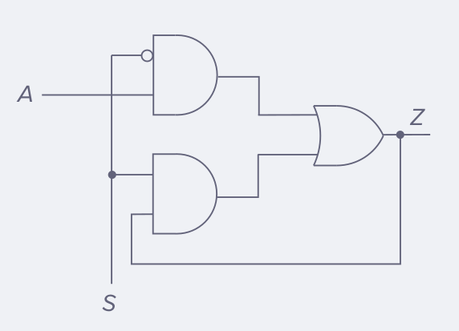

*Ans.-* 
- a. When `S = 0` and `A = 1` the top AND gate yields `1` which ensures that we'll get `Z = 1` after passing through the OR gate. Whereas, if `S = A = 0` nothing survives the AND gates and the output is `Z = 0`
- b. If $S:0\rightarrow 1$ the output will be the last value of $Z$ and gets 'locked'
- c. It is a storage element where the select line $S$ acts as a *writing enable (WE)* element and $A$ is the switch for the latch output $Z$ (`A = 0` resets latch to `0` and `A = 1` sets latch to `1`)

---

- 3.35 A 16-bit register contains a value. The value `x75A2` is written into it. Can the original value be recovered?

*Ans.-* No, there is no physical mechanism to recover the previous stored bits once new ones are written in a register.

---

- 3.37 If a computer has eight-byte addressability and needs three bits to access a location in memory, what is the total size of memory in bytes?

*Ans.-* A 3-bit computer has an *address space* (unique memory locations) of $2^3$ and each location stores 8-bytes. Thus, we have a total memory size of $2^3\times (8 \text{ [bytes]})=64 \text{ [bytes]}$

---

- 3.39 Refer to Figure 3.21, the diagram of the four-entry, $2^2$-by-3-bit memory.
    - a. To read from the fourth memory location, what must the values of $A[1:0]$ and $\text{WE}$ be?
    - b. To change the number of entries in the memory from 4 to 60, how many address lines would be needed? What would the addressability of the memory be after this change was made?
    - c. Suppose the minimum width (in bits) of the program counter (the program counter is a special register within a CPU, and we will discuss it in detail in Chapter 4) is the minimum number of bits needed to address all 60 locations in our memory from part b. How many additional memory locations could be added to this memory without having to alter the width of the program counter?

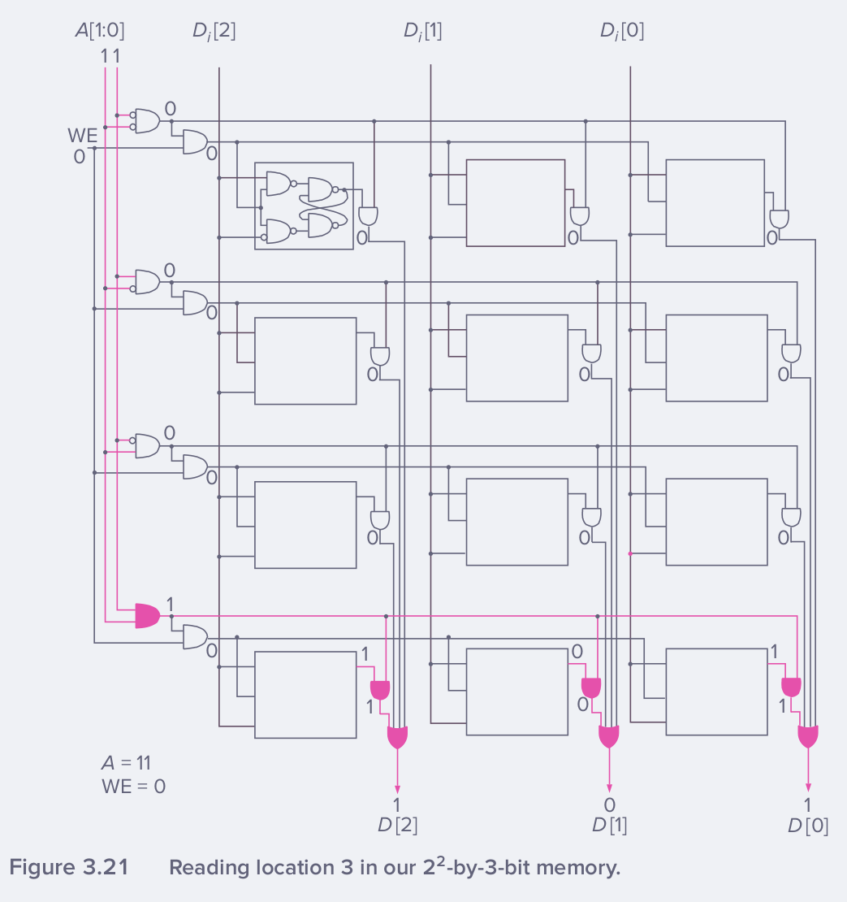

*Ans.-* Quick recap about Figure 3.21. It shows an $n$-bit machine ($n=2$) with *addressability* of $x$-bits ($x=3$). We have an **address space/unique memory locations** of $2^n=4$ where each location stores 3-bit-digit numbers. Thus we see a memory array of $2^2\times 3$ in the figure. To specify the memory rows we need **address bits** $A[\text{high}:\text{low}]$ which basically acts as a *select line* for a specific memory location ie. a complete $(D[\text{high}]+1)$-digit row in the figure that we can read/write from. Address bits accomplish this by passing through a decoder (a unique mask for each bit-input combination of $A$) which results in `1` ONLY for the selected memory location/row and `0` elsewhere. Then, the line $A$ is:

*(i)* ANDed with a *write enable (WE)/clock* which determines if our memory elements (each being a simple R-S latch in our case, could be D-flip-flop registers) are allowed to change the bit value they store throughout the clock-cycle.

*(ii)* ANDed with all $2^n\times 3$ memory elements in the array so basically it is a row mask of `11...1`s for the selected line and `00...0`s for any other row. Subsequently each positional-digit-bit stored in the $A[\text{high}:\text{low}]$-addressed memory location is selected via a *mux* and the value is finally accessed.

- a. $A[1:0]=11$ and $\text{WE}=0$
- b. $n$ lines are needed to uniquely address $2^n$ locations. So for 60 entries we need $n=\log_2{60}=5.91\approx6$ lines.
- c. Minimum width of the program counter refers to the minimum number of bits needed to uniquely address all 60 memory locations which is 6. With 6 bits we can address $2^6=64$ unique memory locations so we only have room to add 4 extra ones.

---

- 3.41 Given a memory that is addressed by 22 bits and is 3-bit addressable, how many bits of storage does the memory contain?

*Ans.-* $2^{22}\times 3 = 12582912 \approx 12\text{ [M-bits]}$

---

- 3.43 In the case of the lock of Figure 3.23a, there are four states $A, B, C$, and $D$, as described in Section 3.6.2. Either the lock is open $(\text{State }D)$, or if it is not open, we have already performed either zero $(\text{State }A)$, one $(\text{State }B)$, or two $(\text{State }C)$ correct operations. This is the sum total of all possible states that can exist. Exercise: Why is that the case? That is, what would be the snapshot of a fifth state that describes a possible situation for the combination lock?

*Ans.-* The four states are enough to describe any configuration of the system. There's really no possible snapshot that cannot be described as one of the four states.

---

- 3.45 Recall again Section 3.6.2. Is it possible to have two states, one where Texas is ahead 30-28 and the other where the score is tied 30-30, but no arc between the two? Draw an example of two scoreboards, one where the score is 30-28 and the other where the score is 30-30, but there can be no arc between the two. For each of the three output values, game in progress, Texas wins, Oklahoma wins, draw an example of a scoreboard that corresponds to a state that would produce that output.

*Ans.-* 

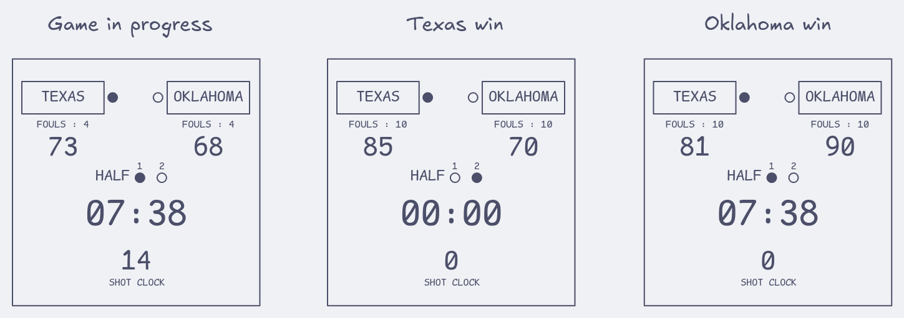

---

- 3.47 The IEEE campus society office sells sodas for 35 cents. Suppose they install a soda controller that only takes the following three inputs: nickel, dime, and quarter. After you put in each coin, you push a pushbutton to register the coin. If at least 35 cents has been put in the controller, it will output a soda and proper change (if applicable). Draw a finite state machine that describes the behavior of the soda controller. Each state will represent how much money has been put in (Hint: There will be seven of these states). Once enough money has been put in, the controller will go to a final state where the person will receive a soda and proper change (Hint: There are five such final states). From the final state, the next coin that is put in will start the process again.

*Ans.-* 

---

- 3.49 The following figure shows an implementation of a finite state machine with an input $X$ and output $Z$. $S1, S0$ specifies the present state. $D1, D0$ specifies the next state.
    - a. Complete the rest of the following table.
    - b. Draw the state diagram for the truth table of part a.

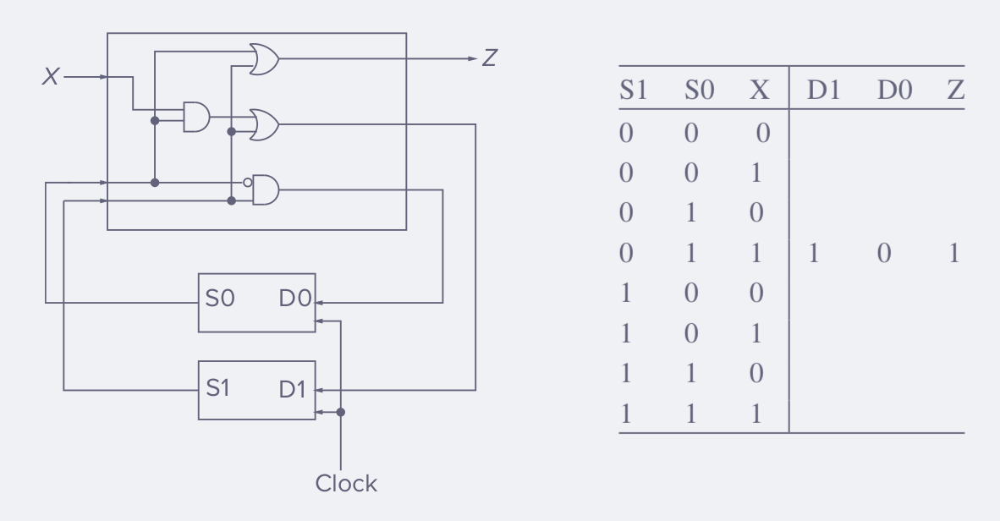

*Ans.-*

- a. 
$$
\begin{array}{ccc|ccc}
S1 & S0 & X & D1 & D0 & Z \\
\hline
0 & 0 & 0 & \color{Violet}0 & \color{Violet}0 & \color{Violet}0  \\
0 & 0 & 1 & \color{Violet}0 & \color{Violet}0 & \color{Violet}0  \\
0 & 1 & 0 & \color{Violet}0 & \color{Violet}0 & \color{Violet}1  \\
0 & 1 & 1 & 1               & 0               & 1                \\
1 & 0 & 0 & \color{Violet}1 & \color{Violet}1 & \color{Violet}1  \\
1 & 0 & 1 & \color{Violet}1 & \color{Violet}1 & \color{Violet}1  \\
1 & 1 & 0 & \color{Violet}1 & \color{Violet}0 & \color{Violet}1  \\
1 & 1 & 1 & \color{Violet}1 & \color{Violet}0 & \color{Violet}1  \\
\end{array}
$$

- b.

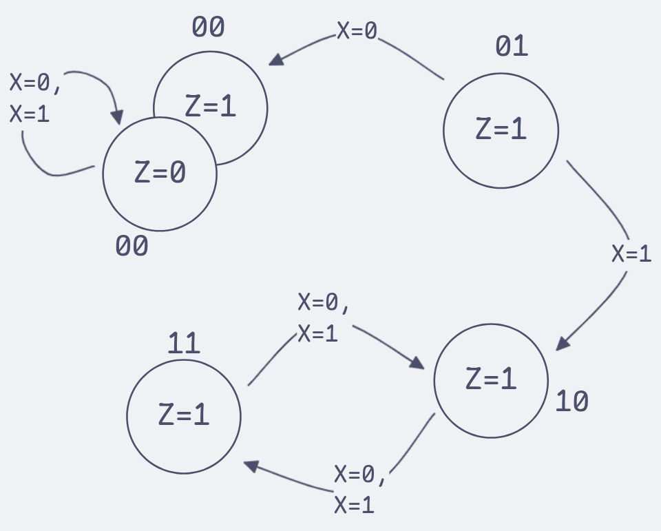

---

- 3.51 We have learned that we can write one bit of information with a logic circuit called a transparent latch and that the bit written is available to be read almost immediately after being written. Sometimes it is useful to be able to store a bit but not be able to read the value of that bit until the next cycle. An example of a logic circuit that has this property is a $\text{\_\_\_\_\_\_}$.

*Ans.-* **Flip-Flop**.

---

- 3.53 The master/slave flip-flop we introduced in the chapter is shown below. Note that the input value is visible at the output after the clock transitions from 0 to 1.

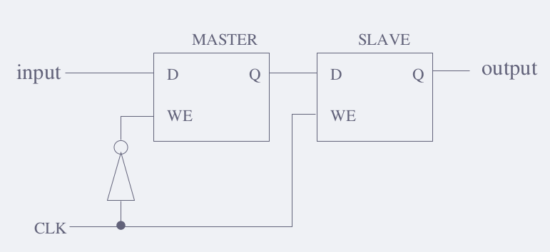

Shown below is a circuit constructed with three of these flip-flops.

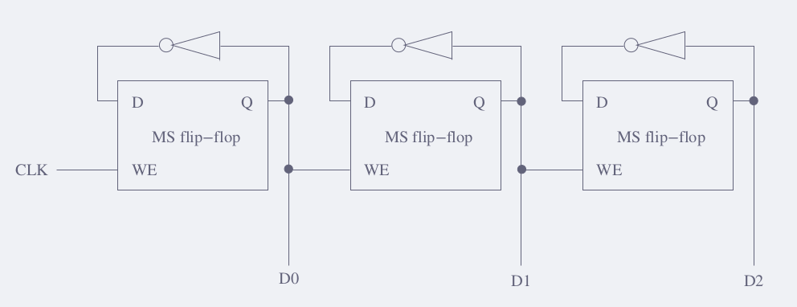

Fill in the entries for D2, D1, D0 for each of clock cycles shown. In ten words or less, what is this circuit doing?

*Ans.-* The circuit is counting down.

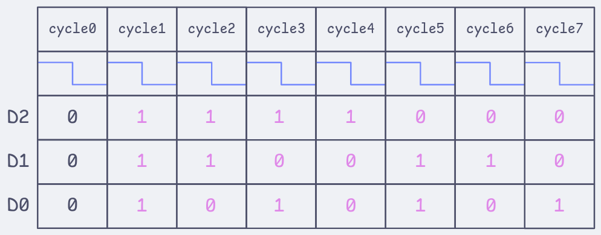

---

- 3.55 We wish to implement two logic functions $Y(a,b,c)$ and $Z(a,b)$. $Y$ is 1 in exactly those cases where an odd number of $a, b$, and $c$ equal 1. $Z$ is the exclusive-OR of $a$ and $b$.
    - a. Construct the truth tables for $Y$ and $Z$.
    - b. Implement the two logic functions $Y$ and $Z$ described above using ONLY the logic circuits provided below: a 3-to-8 decoder and two OR gates. That is, draw the wires from the outputs of the decoder to the inputs of the OR gates as necessary to do the job. You can assume you have as many inputs to each OR gate as you find necessary.

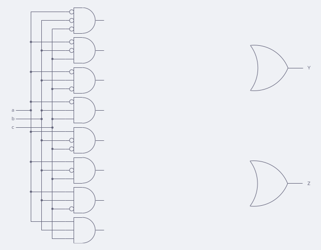

*Ans.-*
- a.
$$
\begin{array}{ccc||c|c}
a & b & c & Y & Z \\
\hline
0 & 0 & 0 & 0 & 0  \\
0 & 0 & 1 & 0 & 0  \\
0 & 1 & 0 & 0 & 1  \\
0 & 1 & 1 & 0 & 1  \\
1 & 0 & 0 & 0 & 1  \\
1 & 0 & 1 & 0 & 1  \\
1 & 1 & 0 & 0 & 0  \\
1 & 1 & 1 & 1 & 0  \\
\end{array}
$$

---

- 3.57 Shown below is a state diagram for a four-state machine and the truth table showing the behavior of this state machine. Some of the entries in both are missing.

Note that the states are labeled `00`, `01`, `10`, and `11` and the output of each state $Z$ (`0` or `1`) is shown in each state. The input is shown as $X$. Your job is to complete both the truth table and the state machine.

*Ans.-*

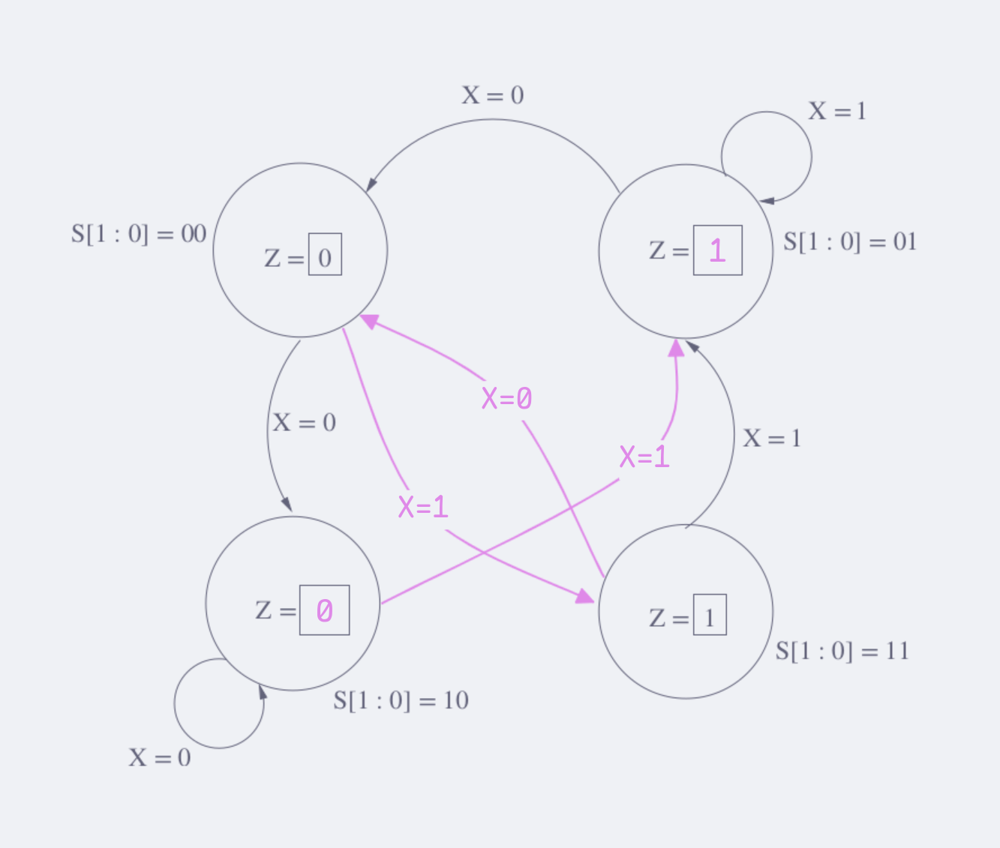

$$
\begin{array}{ccc|ccc}
S[1] & S[0] & X & S'[1] & S'[0] & Z \\
\hline
0 & 0 & 0 & \color{Violet}1 & \color{Violet}0 & \color{Violet}0   \\
0 & 0 & 1 & 1               & 1               & \color{Violet}1   \\
0 & 1 & 0 & \color{Violet}0 & \color{Violet}0 & \color{Violet}0   \\
0 & 1 & 1 & \color{Violet}0 & \color{Violet}1 & 1                 \\
1 & 0 & 0 & \color{Violet}1 & \color{Violet}0 & 0                 \\
1 & 0 & 1 & 0               & 1               & \color{Violet}1   \\
1 & 1 & 0 & 0               & 0               & \color{Violet}0   \\
1 & 1 & 1 & \color{Violet}0 & \color{Violet}1 & \color{Violet}1   \\
\end{array}
$$

---

- 3.59 Most word processors will correct simple errors in spelling and grammar. Your job is to specify a finite state machine that will capitalize the personal pronoun $\text{I}$ in certain instances if it is entered as a lowercase $\text{i}$. For example,

$$
\textbf{i think i’m in love} \text{ will be corrected to } \textbf{I think I’m in love}.
$$

Input to your finite state machine will be any sequence of characters from a standard keyboard. Your job is to replace the $\textbf{i}$ with an $\textbf{I}$ if

$$
\begin{align*}
& \text{the i is the first character input or is preceded by a *space*, and} \\
& \text{the i is followed by a *space* or by an *apostrophe*.}
\end{align*}
$$

Shown below is a finite state machine with some of the inputs and some of the outputs unspecified. Your job is to complete the specification.

Inputs are from the set $\{i, A, S, O\}$, where
$$
\begin{align*}
&A\text{ represents an apostrophe,} \\
&S\text{ represents a space,} \\
&O\text{ represents any character other than i, apostrophe, or *space*}.
\end{align*}
$$

The output $Z$ corresponding to each state is `0` or `1`, where `0` means “do nothing,” `1` means “change the most recent $\textbf{i}$ to an $\textbf{I}$.” 

*Note*: This exercise in developing a finite state machine word processor is only a first step since a lot of “$\text{i}$ to $\text{I}$” will not fix the problem. For example,
$$
\text{i’ am }\rightarrow \text{ I’ am, i’abcd  I’abcd, and i’i } \rightarrow \text{ I’i are all bad!}
$$
But it is a first step!

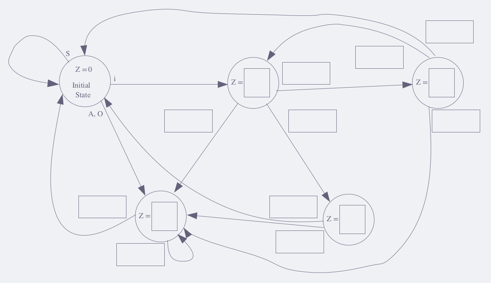

*Ans.-*

---

- 3.61 The logic diagram shown below is a finite state machine.

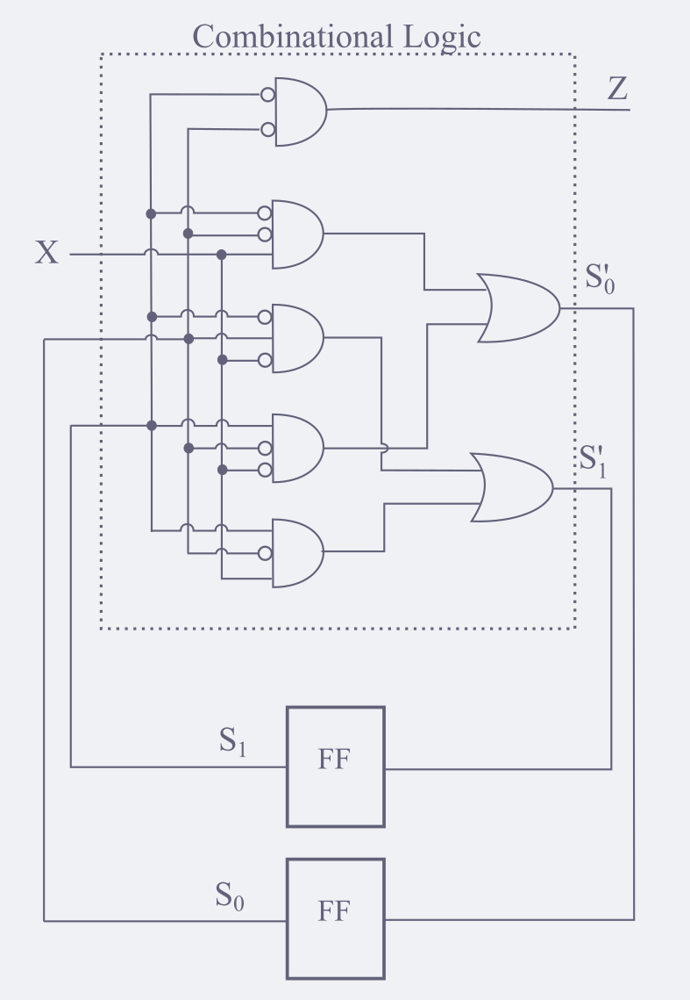

-
    - a. Construct the truth table for the combinational logic.
    - b. Complete the state machine. (We have provided nine states. You will not need all of them. Use only as many as you need):

*Ans.-* 
- a.
$$
\begin{array}{ccc||ccc}
S1 & S0 & X & Z & S1' & S0' \\
\hline
0 & 0 & 0 & 1 & 0 & 0 \\
0 & 0 & 1 & 1 & 0 & 1 \\
0 & 1 & 0 & 0 & 1 & 0 \\
0 & 1 & 1 & 0 & 0 & 0 \\
1 & 0 & 0 & 0 & 0 & 1 \\
1 & 0 & 1 & 0 & 1 & 0 \\
1 & 1 & 0 & 0 & 0 & 0 \\
1 & 1 & 1 & 0 & 0 & 0 \\
\end{array}
$$

- b.

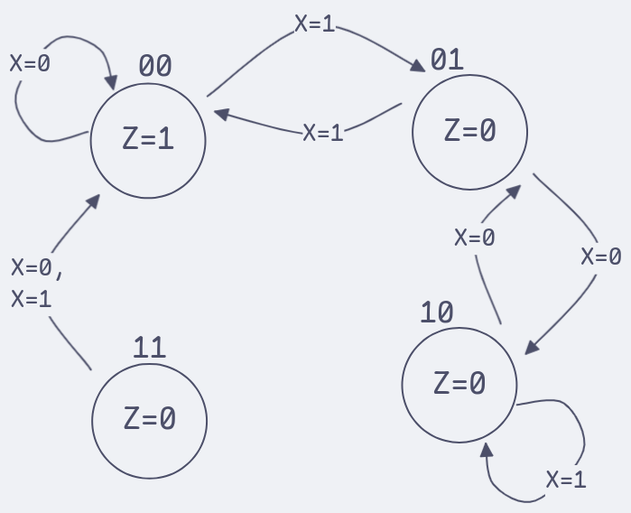

--- 

