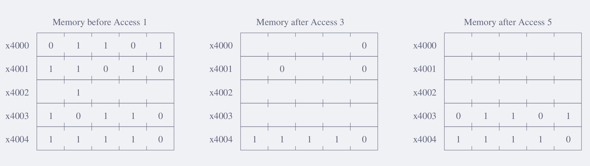
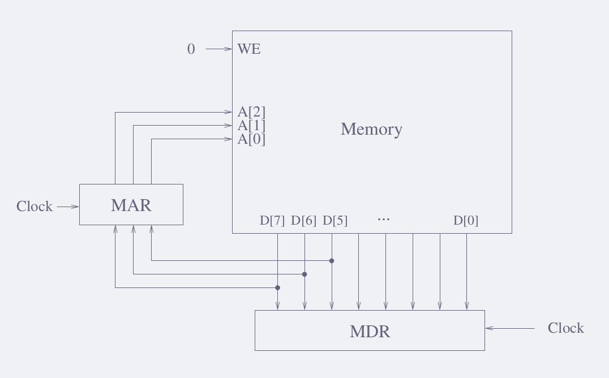

- 4.1 Name the five components of the von Neumann model. For each component, state its purpose.

*Ans.-*

---

- 4.3 What is misleading about the name *program counter*? Why is the name *instruction pointer* more insightful?

*Ans.-*

---

- 4.5 The following table represents a small memory. Refer to this table for the following questions.
    - a. What binary value does location 3 contain? Location 6?
    - b. The binary value within each location can be interpreted in many ways. We have seen that binary values can represent unsigned numbers, 2’s complement signed numbers, floating point numbers, and so forth.
        - (1) Interpret location 0 and location 1 as 2’s complement integers.
        - (2) Interpret location 4 as an ASCII value.
        - (3) Interpret locations 6 and 7 as an IEEE floating point number. Location 6 contains $\text{number}[15:0]$. Location 7 contains $\text{number}[31:16]$.
        - (4) Interpret location 0 and location 1 as unsigned integers.
    - c. In the von Neumann model, the contents of a memory location can also be an instruction. If the binary pattern in location 0 were interpreted as an instruction, what instruction would it represent?
    - d. A binary value can also be interpreted as a memory address. Say the value stored in location 5 is a memory address. To which location contain?

$$
\begin{array}{cc}
\text{Address} & \text{Data} \\
\hline
0000 & 0001\;1110\;0100\;0011 \\
0001 & 1111\;0000\;0010\;0101 \\
0010 & 0110\;0000\;0000\;0001 \\
0011 & 0000\;0000\;0000\;0000 \\
0100 & 0000\;0000\;0110\;0101 \\
0101 & 0000\;0000\;0000\;0110 \\
0110 & 1111\;1110\;1101\;0011 \\
0111 & 0000\;0110\;1101\;1001 \\
\end{array}
$$

*Ans.-*

---

- 4.7 Suppose a 32-bit instruction takes the following format: 
$$
\begin{array}{|c|c|c|c|}
\hline
\text{OPCODE} & \text{SR} & \text{DR} & \text{IMM} \\
\hline
\end{array}
$$
If there are 60 opcodes and 32 registers, what is the range of values that can be represented by the immediate (IMM)? Assume IMM is a 2’s complement value.

*Ans.-*

---

- 4.9 The FETCH phase of the instruction cycle does two important things. One is that it loads the instruction to be processed next into the IR. What is the other important thing?

*Ans.-*

---

- 4.11 State the phases of the instruction cycle, and briefly describe what operations occur in each phase.

*Ans.-*

---

- 4.13 Say it takes 100 cycles to read from or write to memory and only one cycle to read from or write to a register. Calculate the number of cycles it takes for each phase of the instruction cycle for both the IA-32 instruction “ADD [eax], edx” (refer to) and the LC-3 instruction “ADD R6, R2, R6.” Assume each phase (if required) takes one cycle, unless a memory access is required.

*Ans.-*

---

- 4.15 If a HALT instruction can clear the RUN latch, thereby stopping the instruction cycle, what instruction is needed to set the RUN latch, thereby reinitiating the instruction cycle?

*Ans.-*

---

- 4.17 In this problem we perform five successive accesses to memory. The following table shows for each access whether it is a read (load) or write (store), and the contents of the MAR and MDR at the completion of the access. Some entries are not shown. Note that we have shortened the addressability to 5 bits, rather than the 16 bits that we are used to in the LC-3, in order to decrease the excess writing you would have to do.

The following three tables show the contents of memory locations x4000 to x4004 before the first access, after the third access, and after the fifth access. Again, not all entries are shown. We have added an unusual constraint to this problem in order to get one correct answer. The MDR can ONLY be loaded from memory as a result of a load (read) access.

Your job: Fill in the missing entries.
*Hint:* As you know, writes to memory require MAR to be loaded with the memory address and MDR to loaded with the data to be written (stored). The data in the MDR must come from a previous read (load).

*Ans.-*

$$
\begin{array}{l|c|c|rcccc}
  & \text{R/W} & \text{MAR} & \text{MDR} &  &  &  &  \\
\hline
\text{Operation 1} & \text{W}               & \color{Violet}\text{MAR} & 1               & 1               & 1               & 1               & 0               \\
\text{Operation 2} & \color{Violet}\text{W} & \color{Violet}\text{MAR} & \color{Violet}1 & \color{Violet}1 & \color{Violet}1 & \color{Violet}1 & \color{Violet}1 \\
\text{Operation 3} & \text{W}               & \color{Violet}\text{MAR} & 1               & 0               & \color{Violet}1 & \color{Violet}1 & \color{Violet}1 \\
\text{Operation 4} & \color{Violet}\text{W} & \color{Violet}\text{MAR} & \color{Violet}1 & \color{Violet}1 & \color{Violet}1 & \color{Violet}1 & \color{Violet}1 \\
\text{Operation 5} & \color{Violet}\text{W} & \color{Violet}\text{MAR} & \color{Violet}1 & \color{Violet}1 & \color{Violet}1 & \color{Violet}1 & \color{Violet}1 
\end{array}
$$

---

4.19 Shown below is a byte-addressible memory consisting of eight locations, and its associated MAR and MDR. Both MAR and MDR consist of flip-flops that are latched at the start of each clock cycle based on the values on their corresponding input lines. A memory read is initiated every cycle, and the data is available by the end of that cycle.

$$
\begin{array}{r|c}
\text{Memory Location} & \text{Value} \\
\hline
\texttt{x0} & 0101\;0000 \\
\texttt{x1} & 1111\;0001 \\
\texttt{x2} & 1000\;0011 \\
\texttt{x3} & 0001\;0101 \\
\texttt{x4} & 1100\;0110 \\
\texttt{x5} & 1010\;1011 \\
\texttt{x6} & 0011\;1001 \\
\texttt{x7} & 0110\;0010 \\
\end{array}
$$

- Just before the start of cycle 1, MAR contains 000, MDR contains 00010101, and the contents of each memory location is as shown.
    - a. What do MAR and MDR contain just before the end of cycle 1?
    - b. What does MDR contain just before the end of cycle 4?

*Ans.-*

---

