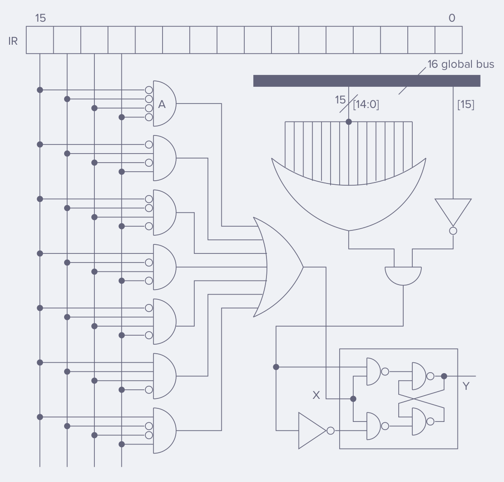
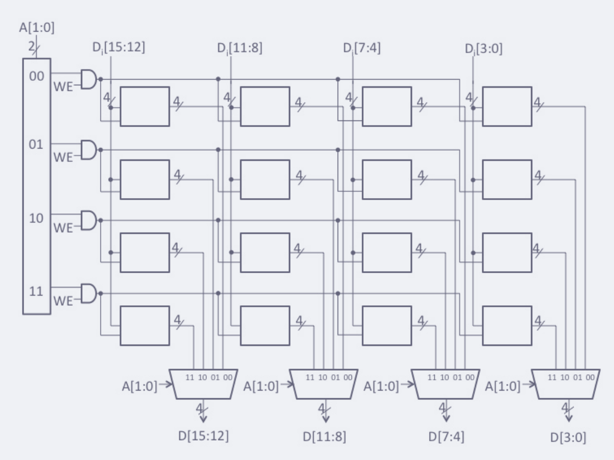
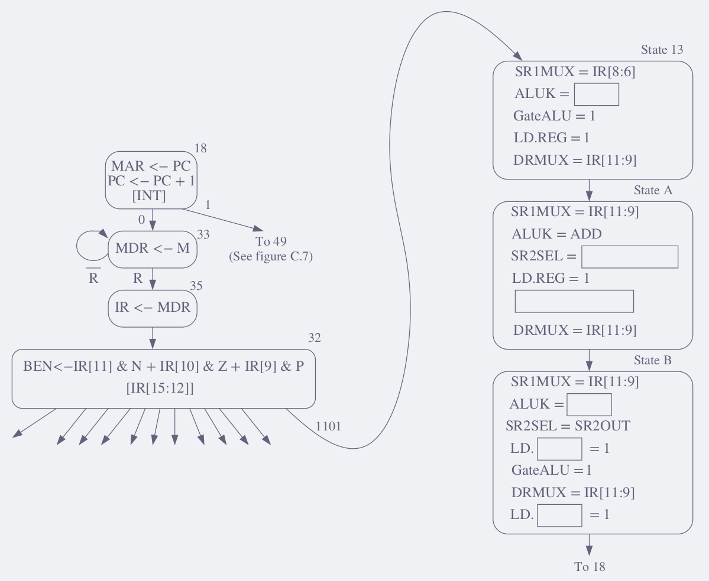
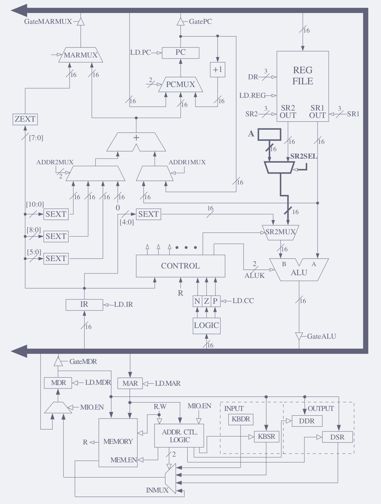
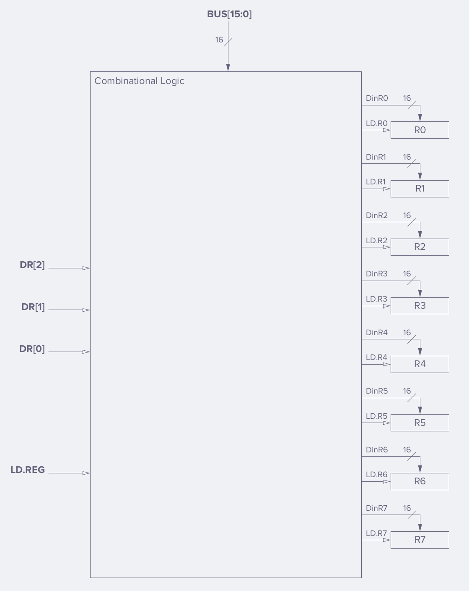
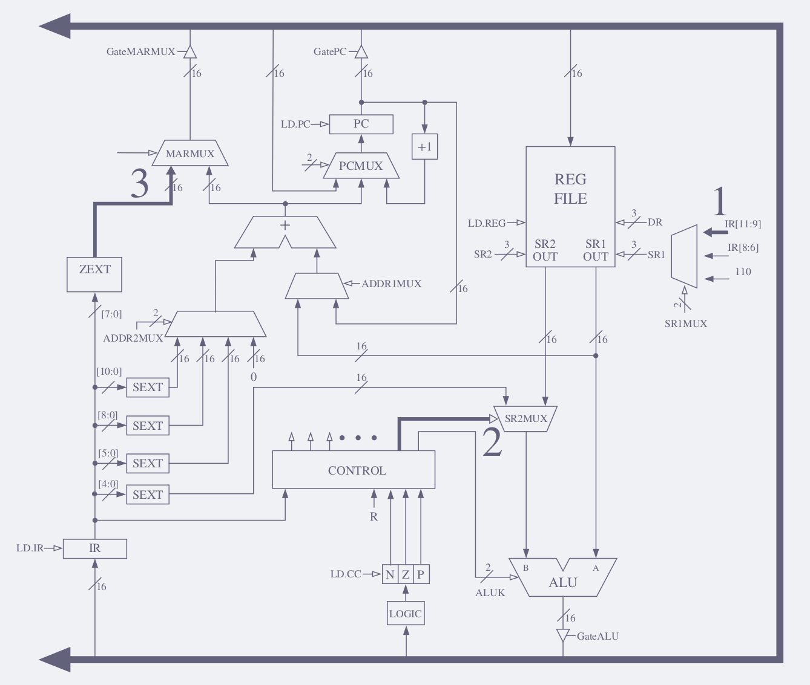
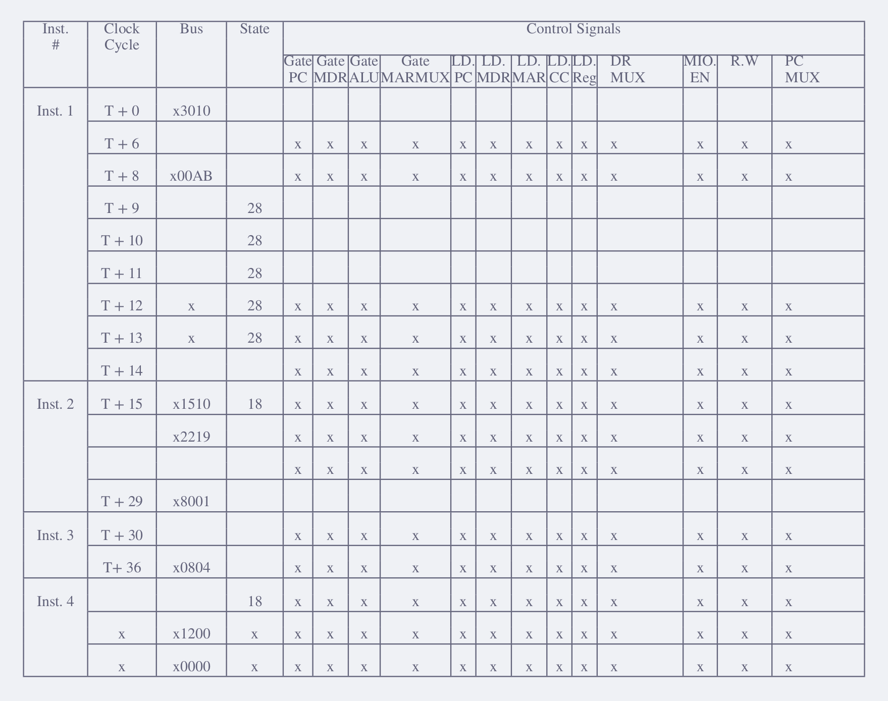

- 5.1 Given instructions ADD, JMP, LEA, and NOT, identify whether the instructions are operate instructions, data movement instructions, or control instructions. For each instruction, list the addressing modes that can be used with the instruction.

*Ans.-*

| Instruction | Type | Addr modes |
|---|---|---|
| `ADD` | operate | Depending on $\texttt{IR[5]}=0^{(i)}\wedge 1^{(ii)}$, the second operand is either *(i)* the value stored in the address of the register specified by $\texttt{IR[2:0]}$. Or *(ii)* an immediate value specified by bits $\texttt{IR[4:0]}$. |
| `JMP` | control | Jumps to instruction located in Base Register specified by bits $\texttt{IR[8:6]}$ | 
| `LEA` | data move | Value stored in $\texttt{IR[8:0]}$ is the offset to compute the effective address that will be loaded into GPR $\texttt{IR[11:9]}$ |
| `NOT` | operate | Inverts the operand stored in $\texttt{IR[8:6]}$ |

---

- 5.3 There are two common ways to terminate a loop. One way uses a counter to keep track of the number of iterations. The other way uses an element called a $\text{\_\_\_\_\_}$. What is the distinguishing characteristic of this element?

*Ans.-* **Sentinel** signals the end of input data depending on a specific flag.

---

- 5.5
    - a. What is an addressing mode?
    - b. Name three places an instruction’s operands might be located.
    - c. List the five addressing modes of the LC-3, and for each one state where the operand is located (from part b).
    - d. What addressing mode is used by the ADD instruction shown in Section 5.1.2?

*Ans.-*

- a. Its a mechanism for specifying where the operand is located.
- b. Memory, General Purpose Registers (GPRs) and immediate values (bits within current instruction).
- c. 
    - *Register* - operand located in any of the $\texttt{R0-R8}$ GPRs
    - *Immediate* - operand located within the instruction ($\texttt{SEXT(imm)}$)
    - *PC Relative* - operand located in memory which address is obtained by a $\texttt{PC + SEXT(offset)}$ calculation
    - *Base + Offset* - operand located in memory ie. is the contents of GPR $\texttt{BaseR + SEXT(offset)}$
    - *Indirect* - operand located in memory which is the **contents** of the **address of the address** of $\texttt{PC + SEXT(offset)}$
- d. The instruction is $\texttt{ADD R2, R0, R1}$ 

$$
\begin{array}{|cccc|ccc|ccc|c|cc|ccc|}
15 & 14 & 13 & 12 & 11 & 10 & 9 & 8 & 7 & 6 & 5 & 4 & 3 & 2 & 1 & 0 \\
\hline
 0 &  0 &  0 &  1 &  0 &  1 & 0 & 0 & 0 & 0 & 0 & 0 & 0 & 0 & 0 & 1 \\
\hline
\end{array}
$$

where the $\texttt{IR[5]}=0$ addressing mode is being used ie. register 2nd operand.

---

- 5.7 What is the largest positive number we can represent literally (i.e., as an immediate value) within an LC-3 ADD instruction?

*Ans.-* The `ADD` istruction has 5 bits reserved in its immediate value addressing mode which allows to represent a range of $[-16,15]$ decimal values.

---

- 5.9 We would like to have an instruction that does nothing. Many ISAs actually have an opcode devoted to doing nothing. It is usually called NOP, for NO OPERATION. The instruction is fetched, decoded, and executed. The execution phase is to do nothing! Which of the following three instructions could be used for NOP and have the program still work correctly?
    - a. `0001 001 001 1 00000`
    - b. `0000 111 000000001`
    - c. `0000 000 000000000`

What does the ADD instruction do that the others do not do?

*Ans.-*
- a. Not equivalent to NOP. Although $\texttt{ADD R1, R1, R0}$ leaves everything unchaged (because adding zero is an identity operation) it changes the **Condition Codes (CC)** as a side effect. Also the computer spends energy performing a useless computation.
- b. Not equivalent to NOP, $\texttt{BRnzp}$ is an unconditional branch meaning that it will always jump to another instruction.
- c. Yes, $\texttt{BR}$ is a branch that will never be taken so it is equivalent to NOP.

---

- 5.11 We wish to execute a single LC-3 instruction that will subtract the decimal number 20 from register 1 and put the result into register 2. Can we do it? If yes, do it. If not, explain why not.

*Ans.-* We can ONLY do it in one instruction if we already have the value of the 2nd operand in a register eg. $\texttt{R}_{2nd}=1111\;1111\;1110\;1100_2=-20_{10}$. Otherwise we need more than one instruction as we typically would use an immediate value $\texttt{ADD R2, R1, \#imm5}$ but we're limited to represent 5-bit numbers ie. $[-16,15]$ and thus $-20$ is out or that range. 

---

- 5.13 
    - a. How might one use a single LC-3 instruction to move the value in R2 into R3?
    - b. The LC-3 has no subtract instruction. How could one perform the following operation using only three LC-3 instructions: $\texttt{R1} \leftarrow \texttt{R2} - \texttt{R3}$
    - c. Using only one LC-3 instruction and without changing the contents of any register, how might one set the condition codes based on the value that resides in R1?
    - d. Is there a sequence of LC-3 instructions that will cause the condition codes at the end of the sequence to be $N = 1, Z = 1$, and $P = 0$? Explain.
    - e. Write an LC-3 instruction that clears the contents of R2.

*Ans.-* 
- a. $0101\;011\;010\;1\;11111\quad(\texttt{AND R3, R2, \#-1})$
- b. 
$$
\begin{array}{rl}
1001\;011\;011\;111111 & (\texttt{NOT R3, R3}) \\
0001\;011\;011\;1\;00001 & (\texttt{ADD R3, R3, \#1}) \\
0001\;001\;010\;0\;00011 & (\texttt{ADD R1, R2, R3})
\end{array}
$$
- c. $0101\;001\;001\;1\;11111\quad(\texttt{AND R1, R1, \#-1})$
- d. There is no way to set $N=1,Z=1,P=0$ condition codes because that would mean a number that is both negative and zero
- e. $0101\;010\;010\;1\;00000\quad(\texttt{AND R2, R2, \#0})$

---

- 5.15 State the contents of R1, R2, R3, and R4 after the program starting at location `x3100` halts.

*Ans.-*

$$
\begin{array}{cccl||l}
 & \text{Address} & \text{Data} & & \color{Violet}\texttt{Contents}\\
\hline
\color{Violet}\texttt{x3100} & 0011\;0001\;0000\;0000 & 1110\;001\;000100000 & \color{Violet}(\texttt{ LEA R1 0x20 }) & \color{Violet}\texttt{R1 <- 0x3121} \\
\color{Violet}\texttt{x3101} & 0011\;0001\;0000\;0001 & 0010\;010\;000100000 & \color{Violet}(\texttt{ LD R2, 0x20 }) & \color{Violet}\texttt{R2 <- M[0x3122] = 0x4566} \\
\color{Violet}\texttt{x3102} & 0011\;0001\;0000\;0010 & 1010\;011\;000100000 & \color{Violet}(\texttt{ LDI R3, 0x20 }) & \color{Violet}\texttt{R3 <- M[M[0x3123]] = M[0x4567] = 0xabcd} \\
\color{Violet}\texttt{x3103} & 0011\;0001\;0000\;0011 & 0110\;100\;010\;000001 & \color{Violet}(\texttt{ LDR R4, R2 0x1 }) & \color{Violet}\texttt{R4 <- M[R2 + 0x0001] = M[0x4567] = 0xabcd} \\
\color{Violet}\texttt{x3104} & 0011\;0001\;0000\;0100 & 1111\;0000\;0010\;0101 & \color{Violet}(\texttt{ TRAP 0x25}) & \\
 & \vdots & \vdots & & \\
\color{Violet}\texttt{x3122} & 0011\;0001\;0010\;0010 & 0100\;0101\;0110\;0110 & \color{Violet}(\texttt{ 0x4566 }) & \\
\color{Violet}\texttt{x3123} & 0011\;0001\;0010\;0011 & 0100\;0101\;0110\;0111 & \color{Violet}(\texttt{ 0x4567 }) & \\
 & \vdots & \vdots & & \\
\color{Violet}\texttt{x4567} & 0100\;0101\;0110\;0111 & 1010\;1011\;1100\;1101 & \color{Violet}(\texttt{ 0xabcd }) & \\
\color{Violet}\texttt{x4568} & 0100\;0101\;0110\;1000 & 1111\;1110\;1101\;0011 & \color{Violet}(\texttt{ 0xfed3 }) & 
\end{array}
$$

---

- 5.17 How many times does the LC-3 make a read or write request to memory during the processing of the LD instruction? How many times during the processing of the LDI instruction? How many times during the processing of the LEA instruction? Processing includes all phases of the instruction cycle.

*Ans.-* Since `LD, LDI` are **Destination Register** type of instructions and `LEA` only handles addresses, all memory access will be *writes* ($\dagger$) and no store. See the table and count the daggers for each instruction:
$$
\begin{array}{c|l|l|l}
\textbf{Phase} & \texttt{LD} & \texttt{LDI} & \texttt{LEA} \\
\hline
             & \texttt{MAR <- PC} & \texttt{MAR <- PC} & \texttt{MAR <- PC}  \\
\text{FETCH} & \texttt{PC <- PC + 1} & \texttt{PC <- PC + 1} & \texttt{PC <- PC + 1}  \\
             & \texttt{MDR <- M[MAR]}(\dagger^1) & \texttt{MDR <- M[MAR]}(\dagger^1) & \texttt{MDR <- M[MAR]}(\dagger^1)  \\
             & \texttt{IR <- MDR} & \texttt{IR <- MDR} &\texttt{IR <- MDR}  \\
\hline
\text{DECODE} & \text{Decode instruction} & \text{Decode instruction} & \text{Decode instruction}  \\
              & \text{into }\texttt{IR} & \text{into }\texttt{IR} & \text{into }\texttt{IR}  \\
\hline
\text{EVALUATE} & \texttt{MAR <- PC + SEXT(offset9)} & \texttt{MAR <- PC + SEXT(offset9)} & \texttt{MAR <- PC + SEXT(offset9)}  \\
\text{ADDRESS}  &  & \texttt{MDR <- M[MAR]}(\dagger^2) & \\
                &  & \texttt{MAR <- MDR} & \\
\hline
\text{FETCH}    & \texttt{MDR <- M[MAR]}(\dagger^2) & \texttt{MDR <- M[MAR]}(\dagger^3) & \texttt{LEA}\text{ fetches no operands} \\
\text{OPERANDS} &  &  &  \\
\hline
\text{EXECUTE} & \texttt{DR <- MDR} & \texttt{DR <- MDR} & \texttt{DR <- MAR} \\
\hline
\text{STORE RESULT} & \text{Set CCs} & \text{Set CCs} & \text{Set CCs} \\
\hline
\hline
\textbf{Total }(\dagger) & \textbf{2 memory reads} & \textbf{3 memory reads} & \textbf{1 memory read} 
\end{array}
$$

---

- 5.19 The LC-3 Instruction Register (IR) is made up of 16 bits, of which the least significant nine bits $[8:0]$ represent the PC-relative offset for the LD instruction. If we change the ISA so that bits $[6:0]$ represent the PC-relative offset, what is the new range of addresses we can load data from using the LD instruction?

*Ans.-* The reduced $\texttt{offset7}$-bits allow to represent a range of $[\texttt{PC}-64, \texttt{PC}+63]$

---

- 5.21 What is the maximum number of TRAP service routines that the LC-3 ISA can support? Explain.

*Ans.-* The TRAP vector is an 8-bit number so LC-3 ISA can support $2^8=256$ TRAP routines.

---

- 5.23 Suppose the following LC-3 program is loaded into memory starting at location x30FF:

If the program is executed, what is the value in R2 at the end of execution?

*Ans.-* 

$$
\begin{array}{cc||ll}
\texttt{x30FF} & 1110\;0010\;0000\;0001 & \color{Violet}\texttt{( LEA R1, 0x1)} & \color{Violet}\texttt{R1 <- 0x3101} \\
\texttt{x3100} & 0110\;0100\;0100\;0010 & \color{Violet}\texttt{( LDR R2, R1, 0x2 )} & \color{Violet}\texttt{R2 <- M[R1 + 0x0002] = M[0x3103] = 0x1482} \\
\texttt{x3101} & 1111\;0000\;0010\;0101 & \color{Violet}\texttt{( TRAP 0x25 )} & \color{Violet}\text{HALTS the program} \\
\texttt{x3102} & 0001\;0100\;0100\;0001 &  & \\
\texttt{x3103} & 0001\;0100\;1000\;0010 &  &  
\end{array}
$$

---

- 5.25 Write an LC-3 program that compares two numbers in R2 and R3 and puts the larger number in R1. If the numbers are equal, then R1 is set equal to 0.

*Ans.-* Since the problem doesn't specify if the numbers stored in R2, R3 are positive or negative we have to account for all cases before writing our program. Typically to identify which number is greater we rely on substracting the numbers and then based on the sign of the difference we can achieve what we want (LC-3 achieves substraction by changing the sign of one of the operands and `ADD`ing). 

$$
\begin{array}{cc|lc|l}
\texttt{R2} & \texttt{R3} & \texttt{ADD R1, R2, (-R3)} & \texttt{CC} & \textbf{simplified}\\
\hline
+ & + & \texttt{R2 + (-R3) < 0} & \texttt{( n )} & \texttt{R2 < R3} \\
+ & + & \texttt{R2 + (-R3) = 0} & \texttt{( z )} & \texttt{R2 = R3} \\
+ & + & \texttt{R2 + (-R3) > 0} & \texttt{( p )} & \texttt{R2 > R3} \\
\hline
+ & - & \texttt{R2 + (-(-R3)) < 0} & \texttt{( n )} & \texttt{R2 < (-R3)}\text{ (never occurs)} \\
+ & - & \texttt{R2 + (-(-R3)) = 0} & \texttt{( z )} & \texttt{R2 = (-R3)} \\
+ & - & \texttt{R2 + (-(-R3)) > 0} & \texttt{( p )} & \texttt{R2 > (-R3)} \\
\hline
- & + & \texttt{(-R2) + (-R3) < 0} & \texttt{( n )} & \texttt{(-R2) < R3} \\
- & + & \texttt{(-R2) + (-R3) = 0} & \texttt{( z )} & \texttt{(-R2) = R3} \\
- & + & \texttt{(-R2) + (-R3) > 0} & \texttt{( p )} & \texttt{(-R2) > R3}\text{ (never occurs)} \\
\hline
- & - & \texttt{(-R2) + (-(-R3)) < 0} & \texttt{( n )} & \texttt{(-R2) < (-R3)} \\
- & - & \texttt{(-R2) + (-(-R3)) = 0} & \texttt{( z )} & \texttt{(-R2) = (-R3)} \\
- & - & \texttt{(-R2) + (-(-R3)) > 0} & \texttt{( p )} & \texttt{(-R2) > (-R3)} 
\end{array}
$$

Fortunately, as we can see from the table above the *Condition Codes* CC will indicate the greater number following the same inequality pattern, so the $\texttt{ADD R1, R2, (-R3)}$ 2's complement arithmetic works! The program is written below

$$
\begin{array}{cc||ll}
\texttt{0x---0} & 1001\;1000\;1111\;1111 & \texttt{( NOT R4, R3 )} & \texttt{R4 <- NOT(R3)} \\
\texttt{0x---1} & 0001\;0000\;0010\;0001 & \texttt{( ADD R4, R4, \#1 )} & \texttt{R4 <- R4 + 0x0001 = -R3} \\
\texttt{0x---2} & 0001\;0010\;1000\;0011 & \texttt{( ADD R1, R2, R3 )} & \texttt{R1 <- R2 + R4} \\
\texttt{0x---3} & 0000\;0100\;0000\;0101 & \texttt{( BRz 0x005)} & \texttt{break to 0x---9} \\
\texttt{0x---4} & 0000\;1000\;0000\;0011 & \texttt{( BRn 0x003)} & \texttt{break to 0x---8} \\
\texttt{0x---5} & 0000\;0010\;0000\;0000 & \texttt{( BRp 0x000)} & \texttt{break to 0x---6} \\
\texttt{0x---6} & 0101\;0010\;1011\;1111 & \texttt{( AND R1, R2, \#-1 )} & \texttt{R1 <- R2} \\
\texttt{0x---7} & 0000\;1110\;0000\;0001 & \texttt{( BRnzp 0x001)} & \texttt{break to 0x---9} \\
\texttt{0x---8} & 0101\;0010\;1111\;1111 & \texttt{( AND R1, R3, \#-1 )} & \texttt{R1 <- R3} \\
\texttt{0x---9} & 1111\;0000\;0010\;0101 & \texttt{( TRAP 0x25 )} & \texttt{HALT} \\
\end{array}
$$

---

- 5.27 Before the seven instructions are executed in the example of Section 5.3.4, R2 contains the value `xAAAA`. How many different values are contained in R2 during the execution of the seven instructions? What are they?

*Ans.-*

---

- 5.29 The LC-3 ISA contains the instruction LDR DR, BaseR, offset. After the instruction is decoded, the following operations (called microinstructions) are carried out to complete the processing of the LDR instruction:

$$
\begin{align*}
&\texttt{MAR} \leftarrow \texttt{BaseR + SEXT(Offset6) ; set up the memory address} \\
&\texttt{MDR} \leftarrow \texttt{Memory[MAR] ; read mem at BaseR + offset} \\
&\texttt{DR} \leftarrow \texttt{MDR ; load DR}
\end{align*}
$$

- Suppose that the architect of the LC-3 wanted to include an instruction $\texttt{MOVE DR, SR}$ that would copy the memory location with address given by SR and store it into the memory location whose address is in DR.
    - a. The $\texttt{MOVE}$ instruction is not really necessary since it can be accomplished with a sequence of existing LC-3 instructions. What sequence of existing LC-3 instructions implements (also called “emulates”) $\texttt{MOVE R0,R1}$?
    - b. If the $\texttt{MOVE}$ instruction were added to the LC-3 ISA, what sequence of microinstructions, following the decode operation, would emulate $\texttt{MOVE DR,SR}$?

*Ans.-*

---

5.31 The figure below shows a snapshot of the eight registers of the LC-3 before and after the instruction at location `x1000` is executed. Fill in the bits of the instruction at location `x1000`.

$$
\begin{array}{rccrc}
& \text{BEFORE} &  &  & \text{AFTER} \\
\texttt{R0} & \texttt{x0000} &  & \texttt{R0} & \texttt{x0000} \\
\texttt{R1} & \texttt{x1111} &  & \texttt{R1} & \texttt{x1111} \\
\texttt{R2} & \texttt{x2222} &  & \texttt{R2} & \texttt{x2222} \\
\texttt{R3} & \texttt{x3333} &  & \texttt{R3} & \texttt{x3333} \\
\texttt{R4} & \texttt{x4444} &  & \texttt{R4} & \texttt{x4444} \\
\texttt{R5} & \texttt{x5555} &  & \texttt{R5} & \texttt{x5555} \\
\texttt{R6} & \texttt{x6666} &  & \texttt{R6} & \texttt{x6666} \\
\texttt{R7} & \texttt{x7777} &  & \texttt{R7} & \texttt{x7777} \\
\end{array}
$$

*Ans.-*
$$
\begin{array}{lc}
\texttt{0x1000 :} & \boxed{0001\;\color{Violet}----\;----\;----}
\end{array}
$$

---

5.33 If the value stored in R0 is 5 at the end of the execution of the following instructions, what can be inferred about R5?
$$
\begin{array}{ccccc}
\texttt{x2FFF} & 0101 & 0000 & 0010 & 0000 \\
\texttt{x3000} & 0101 & 1111 & 1110 & 0000 \\
\texttt{x3001} & 0001 & 1101 & 1110 & 0001 \\
\texttt{x3002} & 0101 & 1001 & 0100 & 0110 \\
\texttt{x3003} & 0000 & 0100 & 0000 & 0001 \\
\texttt{x3004} & 0001 & 0000 & 0010 & 0001 \\
\texttt{x3005} & 0001 & 1101 & 1000 & 0110 \\
\texttt{x3006} & 0001 & 1111 & 1110 & 0001 \\
\texttt{x3007} & 0001 & 0011 & 1111 & 1000 \\
\texttt{x3008} & 0000 & 1001 & 1111 & 1001 \\
\texttt{x3009} & 0101 & 1111 & 1110 & 0000
\end{array}
$$

*Ans.-*

---

5.35 Using the overall data path in Figure 5.18, identify the elements that implement the ADD instruction of Figure 5.5.

*Ans.-*

---

5.37 Using the overall data path in Figure 5.18, identify the elements that implement the LDI instruction of Figure 5.8.

*Ans.-*

---

5.39 Using the overall data path in Figure 5.18, identify the elements that implement the LEA instruction of Figure 5.6.

*Ans.-*

---

- 5.41 A part of the implementation of the LC-3 architecture is shown in the following diagram.
    - a. What information does $Y$ provide?
    - b. The signal $X$ is the control signal that gates the gated D latch. Is there an error in the logic that produces $X$?

*Ans.-*

---

5.43 When a computer executes an instruction, the state of the computer is changed as a result of that execution. Is there any difference in the state of the LC-3 computer as a result of executing instruction 1 below vs. executing instruction 2 below? Explain. We can assume the state of the LC-3 computer before execution is the same in both cases.
$$
\begin{align*}
&\texttt{instruction 1: 0001 000 000 1 00000 register 0 <-- register 0 + \textbackslash\#0} \\
&\texttt{instruction 2: 0000 111 000000000 branch to PC' + \textbackslash\#0 if any of N, Z, or P is set}
\end{align*}
$$

*Ans.-*

---

5.45 In class we showed the first few states of the finite state machine that is required for processing instructions of a computer program written for LC-3. In the first state, the computer does two things, represented as:
$$
\begin{align*}
&\texttt{MAR} \leftarrow \texttt{PC} \\
&\texttt{PC} \leftarrow \texttt{PC + 1}
\end{align*}
$$

Why does the microarchitecture put the contents of the PC into the MAR? Why does the microarchitecture increment the PC?

*Ans.-*

---

- 5.47 The following diagram describes a 22 by 16-bit memory. Each of the four muxes has four-bit input sources and a four-bit output, and each four-bit source is the output of a single four-bit memory cell.

- a. Unfortunately, the memory was wired by a student, and he got the inputs to some of the muxes mixed up. That is, instead of the four bits from a memory cell going to the correct four-bit input of the mux, the four bits all went to one of the other four-bit sources of that mux. The result was, as you can imagine, a mess. To figure out the mix-up in the wiring, the following sequence of memory accesses was performed: 
$$
\begin{array}{c|c|c}
\text{Read/Write} & \text{MDR} & \text{MAR} \\
\hline
\text{Write} & \texttt{x134B} & 01 \\
\text{Write} & \texttt{xFCA2} & 10 \\
\text{Write} & \texttt{xBEEF} & 11 \\
\text{Write} & \texttt{x072A} & 00 \\
\text{Read}  & \texttt{xF34F} & 10 \\
\text{Read}  & \texttt{x1CAB} & 01 \\
\text{Read}  & \texttt{x0E2A} & 00 \\
\end{array}
$$
Note: On a write, MDR is loaded before the access. On a read, MDR is loaded as a result of the access. Your job is to identify the mix-up in the wiring. Show which memory cells were wired to which mux inputs by filling in their corresponding addresses in the blanks provided. Note that one address has already been supplied for you.
- b. After rewiring the muxes correctly and initializing all memory cells to $\texttt{xF}$, the following sequence of accesses was performed. Note that some of the information about each access has been left out. Your job: Fill in the blanks. Show the contents of the memory cells by putting the hex digit that is stored in each after all the accesses have been performed.
$$
\begin{array}{c|c|c}
\text{Read/Write} & \text{MDR} & \text{MAR} \\
\hline
\text{Write} & \texttt{x72{\color{Violet}--}}                 & 0\color{Violet}- \\
\text{Write} & \texttt{x8FAF}                                 & 11 \\
\text{Read}  & \texttt{x72A3}                                 & {\color{Violet}-}0 \\
\text{Read}  & \texttt{xFFFF}                                 & 1\color{Violet}- \\
\text{Write} & \texttt{x732D}                                 & {\color{Violet}-}1 \\
\text{Read}  & \texttt{xFFFF}                                 & 0\color{Violet}- \\
\text{Write} & \texttt{x{\color{Violet}-}7{\color{Violet}--}} & 0\color{Violet}- \\
\text{Read}  & \texttt{x37A3}                                 & {\color{Violet}-}1 \\
\text{Read}  & \texttt{x{\color{Violet}---}D}                 & {\color{Violet}-}1 \\
\end{array}
$$
Show the contents of the memory cells by putting the hex digit that is stored in each after all the accesses have been performed.

*Ans.-*

---

5.49 We wish to know if R0 is being used as the Base Register for computing the address in an LDR instruction. Since the instruction is in memory, we can load it into R4. And, since the Base Register is identified in bits 8:6 of the instruction, we can load R5 with `0000 0001 1100 0000` and then execute $\texttt{AND R6,R5,R4}$. We would know that R0 is the base register if what condition is met?

*Ans.-*

---

5.51 An aggressive young engineer decides to build and sell the LC-3 but is told that if he wants to succeed, he really needs a SUBTRACT instruction. Given the unused opcode 1101, he decides to specify the SUBTRACT instruction as follows:
$$
\begin{array}{rrrr|rrr|rrr|rrr|rrr}
15 &  &  & 12 & 11 &  & 9 & 8 &  & 6 & 5 &  & 3 & 2 &  & 0 \\
\hline
1 & 1 & 0 & 1 &  & \texttt{DR} &  &  & \texttt{SR1} &  & 0 & 0 & 0 &  & \texttt{SR2} &  \\
\hline
\end{array}
$$
The instruction is defined as: DR \leftarrow SR2 - SR1, and the condition codes are set. Assume $\texttt{DR, SR1,}$ and $\texttt{SR2}$ are all different registers. To accomplish this, the engineer needs to add three states to the state machine and a mux and register A to the data path. The modified state machine is shown below, and the modified data path is shown on the next page. The mux is controlled by a new control signal $\texttt{SR2SEL}$, which selects one of its two sources.
$$\texttt{SR2SEL/1: SR2OUT, REGISTER\_A}$$

*Your job:* For the state machine shown below, fill in the empty boxes with the control signals that are needed in order to implement the SUBTRACT instruction. 

For the data path, fill in the value in register A.

*Ans.-*

---

- 5.53 The eight general purpose registers of the LC-3 (R0 to R7) make up the register file. To write a value to a register, the LC-3 control unit must supply 16 bits of data ($\texttt{BUS[15:0]}$), a destination register ($\texttt{DR[2:0]}$), and a write enable signal (LD.REG) to load a register. The combinational logic block shows inputs $\texttt{BUS[15:0], DR[2:0]}$, and $\texttt{LD.REG}$ and outputs $\texttt{DinR0[15:0], DinR1[15:0], DinR2[15:0],} \ldots \texttt{DinR7[15:0], LD.R0, LD.R1, LD.R2,} \ldots \texttt{LD.R7}$

*Your job:* Add wires, logic gates, and standard logic blocks as necessary to complete the combinational logic block. 

*Note:* If you use a standard logic block, it is not necessary to show the individual gates. However, it is necessary to identify the logic block specifically (e.g., “16-to-1 mux”), along with labels for each relevant input or output, according to its function.

*Ans.-*

---

- 5.55 An LC-3 program starts execution at `x3000`. During the execution of the program, snapshots of all eight registers were taken at six different times as shown below: before the program executes, after execution of
    - instruction 1, after execution of instruction 2, after execution of
    - instruction 3, after execution of instruction 4, after execution of
    - instruction 5, and after execution of instruction 6.
Also, during the execution of the program, the PC trace, the MAR trace, and the MDR trace were also recorded as shown below. Note that a PC trace records the addresses of the instructions executed in sequence by the program.

Your job: Fill in the missing entries in the three tables.

*Ans.-*

$$
\begin{array}{l|c|c|c|c|c|c|c}
\textbf{Registers} & \textbf{Initial} & \textbf{After 1st} &  \textbf{After 2nd} & \textbf{After 3rd} & \textbf{After 4th} & \textbf{After 5th} & \textbf{After 6th} \\
& \textbf{Value} & \textbf{Instruction} & \textbf{Instruction} & \textbf{Instruction} & \textbf{Instruction} & \textbf{Instruction} & \textbf{Instruction} \\
\hline
\textbf{R0} & \texttt{x4006} & \texttt{x4050} & \texttt{x4050} & \texttt{x4050} & \texttt{x4050} & \texttt{x4050} & \texttt{x4050} \\
\textbf{R1} & \texttt{x5009} & \texttt{x5009} & \texttt{x5009} & \texttt{x5009} & \texttt{x5009} & \texttt{x5009} & \texttt{x5009} \\
\textbf{R2} & \texttt{x4008} & \texttt{x4008} & \texttt{x4008} & \texttt{x4008} & \texttt{x4008} & \texttt{x4008} & \texttt{xC055} \\
\textbf{R3} & \texttt{x4002} & \color{Violet}\texttt{-} & \color{Violet}\texttt{-} & \texttt{x8005} & \texttt{x8005} & \texttt{x8005} & \texttt{x8005} \\
\textbf{R4} & \texttt{x4003} & \texttt{x4003} & \texttt{x4003} & \texttt{x4003} & \color{Violet}\texttt{-} & \color{Violet}\texttt{-} & \texttt{x4003} \\
\textbf{R5} & \texttt{x400D} & \texttt{x400D} & \color{Violet}\texttt{-} & \color{Violet}\texttt{-} & \texttt{x400D} & \texttt{x400D} & \texttt{x400D} \\
\textbf{R6} & \texttt{x400C} & \texttt{x400C} & \texttt{x400C} & \texttt{x400C} & \texttt{x400C} & \texttt{x400C} & \texttt{x400C} \\
\textbf{R7} & \texttt{x6001} & \texttt{x6001} & \texttt{x6001} & \texttt{x6001} & \color{Violet}\texttt{-} & \color{Violet}\texttt{-} & \texttt{x400E} 
\end{array}
$$

$$
\begin{array}{c||c|c}
\textbf{PC Trace} & \textbf{MAR Trace} & \textbf{MDR Trace} \\
\hline
\color{Violet}\texttt{x----} & \color{Violet}\texttt{x----} & \texttt{xA009} \\
\color{Violet}\texttt{x----} & \color{Violet}\texttt{x----} & \color{Violet}\texttt{x----} \\
\color{Violet}\texttt{x----} & \texttt{x3025}               & \color{Violet}\texttt{x----} \\
\texttt{x400D}               & \color{Violet}\texttt{x----} & \texttt{x1703}               \\
\color{Violet}\texttt{x----} & \color{Violet}\texttt{x----} & \color{Violet}\texttt{x----} \\
\texttt{x400E}               & \color{Violet}\texttt{x----} & \texttt{x4040}               \\
& \color{Violet}\texttt{x----} & \color{Violet}\texttt{x----} \\
& \color{Violet}\texttt{x400E} & \texttt{x1403} 
\end{array}
$$

---

- 5.57 Note boldface signal lines on the following data path.
    - 1. What opcodes use $\texttt{IR }[11:9]$ as inputs to $\texttt{SR1}$?
    - 2. Where does the control signal of this mux come from? Be specific!
    - 3. What opcodes use this input to the MARMUX?

*Ans.-*

---

- 5.59 Every LC-3 instruction takes eight cycles to be fetched and decoded, if we assume every memory access takes five cycles. The total number of cycles an LC-3 instruction takes to be completely processed, however, depends on what has to be done for that instruction. Assuming every memory access takes five cycles, and assuming the LC-3 processes one instruction at a time, from beginning to end, how many clock cycles does each instruction take? For each instruction, how many cycles are required to process it?

*Ans.-*
$$
\begin{array}{r|c}
\text{Instruction} & \text{Num. of cycles} \\
\hline
\texttt{ADD} & \color{Violet}- \\
\texttt{ADD} & \color{Violet}- \\
\texttt{LD} & \color{Violet}- \\
\texttt{LEA} & \color{Violet}- \\
\texttt{LDI} & \color{Violet}- \\
\texttt{NOT} & \color{Violet}- \\
\texttt{BTnzp} & \color{Violet}- \\
\texttt{TRAP} & \color{Violet}- 
\end{array}
$$

---

- 5.61 During the execution of an LC-3 program, the processor data path was monitored for four instructions in the program that were processed consecutively. The table shows all clock cycles during which the bus was utilized. It shows the clock cycle number, the value on the bus, and the state (from the state machine diagram) for some of these clock cycles. Processing of the first instruction starts at clock cycle T. Each memory access in this LC-3 machine takes five clock cycles. 

Your job: Fill in the missing entries in the table. You only need to fill in the cells not marked with x. 

*Note:* There are five clock cycles for which you need to provide the control signals. Not all LC-3 control signals are shown in the table. However, all control signals that are required for those five clock cycles have been included. 

*Note:* For the DRMUX signal, write ‘11.9’, ‘R7’, or ‘SP’; for the R.W signal, write an ‘R’ or a ‘W’; for the PCMUX signal, write ‘PC+1’, ‘BUS’, or ‘ADDER’; for all other control signals, write down the actual bit. If a control signal is not relevant in a given cycle, mark it with a dash (i.e., -).

*Ans.-*

---

