# Chapter 2 - Bits, datatypes and operations

- 2.40 Write the decimal equivalents for these IEEE floating point numbers.
    - a. `0 10000000 00000000000000000000000`
    - b. `1 10000011 00010000000000000000000`
    - c. `0 11111111 00000000000000000000000`
    - d. `1 10000000 10010000000000000000000`

*Ans.-*

---

- 2.42 A computer programmer wrote a program that adds two numbers. The programmer ran the program and observed that when 5 is added to 8, the result is the character $m$. Explain why this program is behaving erroneously.

*Ans.-*

---

- 2.44 What operation(s) can be used to convert the binary representation for 3 (i.e., `0000 0011`) into the ASCII representation for 3 (i.e., `0011 0011`)? What about the binary 4 into the ASCII 4? What about any digit?

*Ans.-*

---

- 2.46 Convert the following hexadecimal numbers to binary.
    - a. `x10`
    - b. `x801`
    - c. `xF731`
    - d. `x0F1E2D`
    - e. `xBCAD`

*Ans.-*

---

- 2.48 Convert the following decimal numbers to hexadecimal representations of 2’s complement numbers.
    - a. $256$
    - b. $111$
    - c. $123,456,789$
    - d. $−44$

*Ans.-*

---

- 2.50 Perform the following logical operations. Express your answers in hexadecimal notation.
    - a. `x5478 AND xFDEA`
    - b. `xABCD OR x1234`
    - c. `NOT((NOT(xDEFA)) AND (NOT(xFFFF)))`
    - d. `x00FF XOR x325C`

*Ans.-*

---

- 2.52 Consider two hexadecimal numbers: `x434F4D50` and `x55544552`. What values do they represent for each of the five data types shown?

*Ans.-*

| | `x434F4D50` | `x55544552` |
|---|---|---|  
| Unsigned binary | & | & |
| 1's complement | & | & |
| 2's complement | & | & |
| IEEE 754 floating point | & | & |
| ASCII string | & | & |

---

- 2.54 Fill in the truth table for the equations given. The first line is done as an example.
$$
\begin{align*}
&Q_1 = \text{NOT(NOT(X) OR (A AND Y AND Z))} \\
&Q_2 = \text{NOT((Y OR Z) AND (X AND Y AND Z))} 
\end{align*}
$$

*Ans.-*

$$
\begin{array}{ccc|cc}
X & Y & Z & Q_1 & Q_2 \\
\hline
0 & 0 & 0 & 1 & 0 \\
0 & 0 & 1 &   &   \\
0 & 1 & 0 &   &   \\
0 & 1 & 1 &   &   \\
1 & 0 & 0 &   &   \\
1 & 0 & 1 &   &   \\
1 & 1 & 0 &   &   \\
1 & 1 & 1 &   &   \\
\end{array}
$$

---

- 2.56 Define a new eight-bit floating point format with one sign bit, four bits of exponent, using an excess-7 code (i.e., the bias is 7), and three bits of fraction. If `xE5` is the bit pattern for a number in this eight-bit floating point format, what value does it have? (Express as a decimal number.)

*Ans.-*

---

# Chapter 3 - Digital logic structures


- 3.2 Replace the missing parts in the following circuit with either a wire or no wire to give the output OUT a logical value of 0 when the input IN is a logical 1.

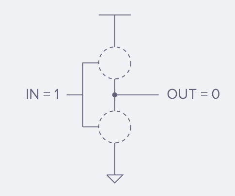

*Ans.-*

---

- 3.4 Replace the missing parts in the following circuit with either a wire or no wire to give the output C a logical value of 1. Describe a set of inputs that give the output C a logical value of 0. Replace the missing parts with wires or no wires corresponding to that set of inputs.

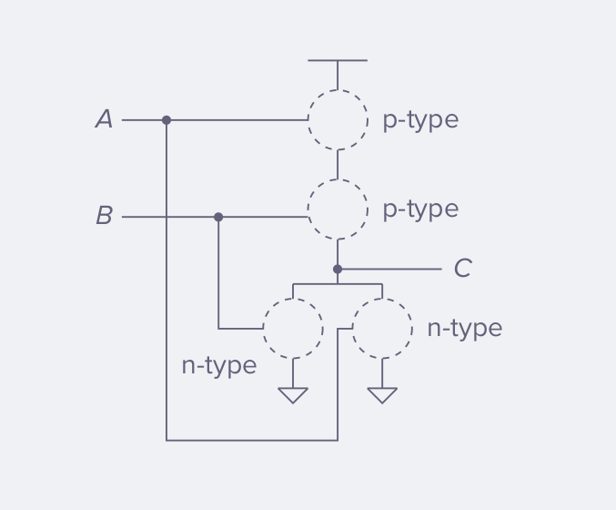

*Ans.-*

---

- 3.6 For the transistor-level circuit in Figure 3.38, fill in the truth table. What is Z in terms of A and B?

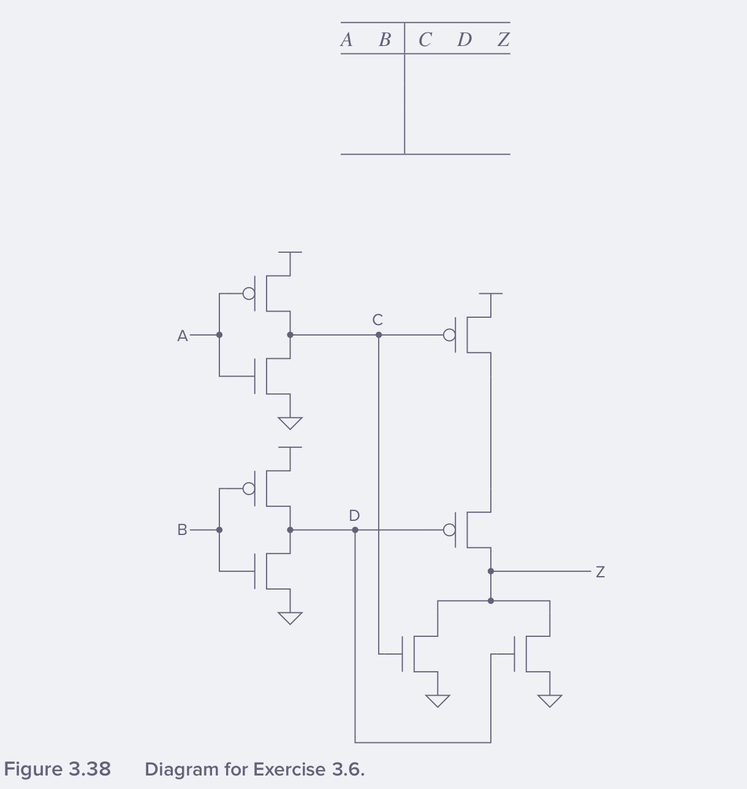

*Ans.-*

$$
\begin{array}{cc|ccc}
A & B & C & D & Z \\
\hline
  &  &  &  &
\end{array}
$$

---

- 3.8 The transistor-level circuit below implements the logic equation given below. Label the inputs to all the transistors.

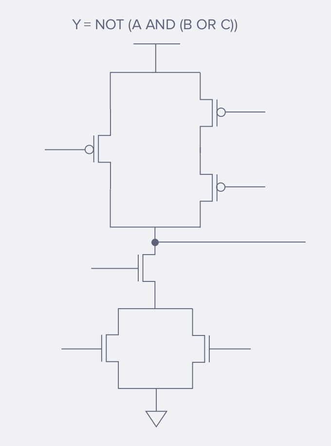

*Ans.-*

---

- 3.10 For what values of A, B, C, D, E, and F will the output of the six-input AND gate be 1?

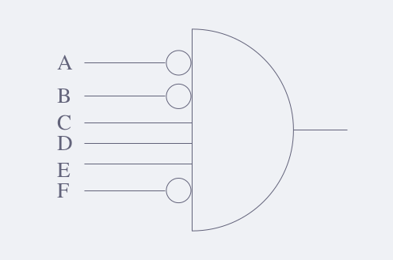

*Ans.-*

---

- 3.12 A function is described by the truth table shown on the left. Your job: Complete the logic implementation shown on the right by adding the appropriate connections.

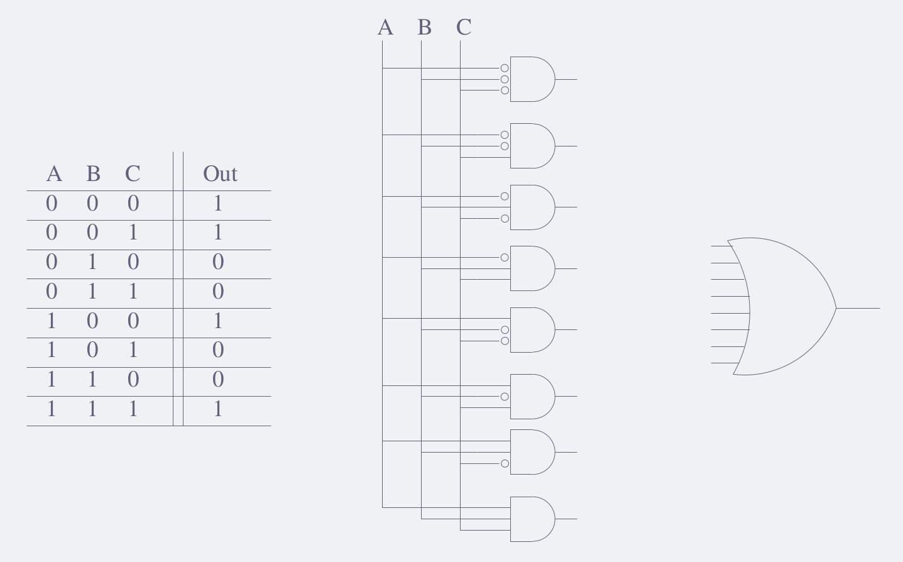

*Ans.-* 

---

- 3.14 The following logic circuits consist of two exclusive-OR gates. Construct the output truth table.

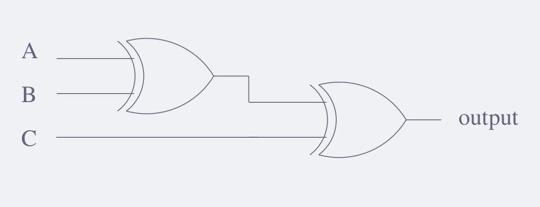

*Ans.-*
$$
\begin{array}{ccc|c}
A & B & C & \text{output} \\
\hline
 & & & 
\end{array}
$$

---

- 3.16 Fill in the truth table for a two-input NOR gate.

*Ans.-*
$$
\begin{array}{cc|c}
A & B & \text{A NOR B} \\
\hline
0 & 0 &  \\
0 & 1 &  \\
1 & 0 &  \\
1 & 1 &  \\
\end{array}
$$

---

- 3.18 Following the example of Figure 3.11a, draw the gate-level schematic of a three-input decoder. For each output of this decoder, write the input conditions under which that output will be 1.

*Ans.-*

---

- 3.20 How many output lines will a 16-input multiplexer have? How many select lines will this multiplexer have?

*Ans.-*

---

- 3.22 Given the following truth table, generate the gate-level logic circuit, using the implementation algorithm referred to in Section 3.3.4.

$$
\begin{array}{ccc|c}
A & B & C & Z \\
\hline
0 & 0 & 0 & 1 \\
0 & 0 & 1 & 0 \\
0 & 1 & 0 & 0 \\
0 & 1 & 1 & 1 \\
1 & 0 & 0 & 0 \\
1 & 0 & 1 & 1 \\
1 & 1 & 0 & 1 \\
1 & 1 & 1 & 0 \\
\end{array}
$$

*Ans.-*

---

- 3.24 Implement the following functions using AND, OR, and NOT logic gates. The inputs are A, B, and the output is F.
    - a. $F$ has the value 1 only if $A$ has the value 0 and $B$ has the value 1.
    - b. $F$ has the value 1 only if $A$ has the value 1 and $B$ has the value 0.
    - c. Use your answers from parts a and b to implement a one-bit adder. The truth table for the one-bit adder is given below.
    - d. Is it possible to create a four-bit adder (a circuit that will correctly add two 4-bit quantities) using only four copies of the logic diagram from part c? If not, what information is missing? Hint: When A = 1 and B = 1, a sum of 0 is produced. What information is lost?

$$
\begin{array}{ccc}
A & B & \text{Sum} \\
\hline
0 & 0 & 0 \\
0 & 1 & 1 \\
1 & 0 & 1 \\
1 & 1 & 0 \\
\end{array}
$$

*Ans.-* 

---

- 3.26 Generate the gate-level logic that implements the following truth table. From the gate-level structure, generate a transistor diagram that implements the logic structure. Verify that the transistor diagram implements the truth table.

$$
\begin{array}{cc|c}
\text{in}_0 & \text{in}_1 & f(\text{in}_0,\text{in}_1) \\
\hline
0 & 0 & 1 \\
0 & 1 & 0 \\
1 & 0 & 1 \\
1 & 1 & 1 \\
\end{array}
$$

*Ans.-*

---

- 3.28 Implement a 4-to-1 mux using only 2-to-1 muxes making sure to properly connect all of the terminals. Remember that you will have four inputs, two control signals, and one output. Write out the truth table for this circuit.

*Ans.-*

---

- 3.30
    - a. Figure 3.42 shows a logic circuit that appears in many of today’s processors. Each of the boxes is a full-adder circuit. What does the value on the wire $X$ do? That is, what is the difference in the output of this circuit if $X = 0$ vs. if $X = 1$?
    - b. Construct a logic diagram that implements an adder/subtractor. That is, the logic circuit will compute $A + B$ or $A - B$ depending on the value of $X$. Hint: Use the logic diagram of Figure 3.42 as a building block.

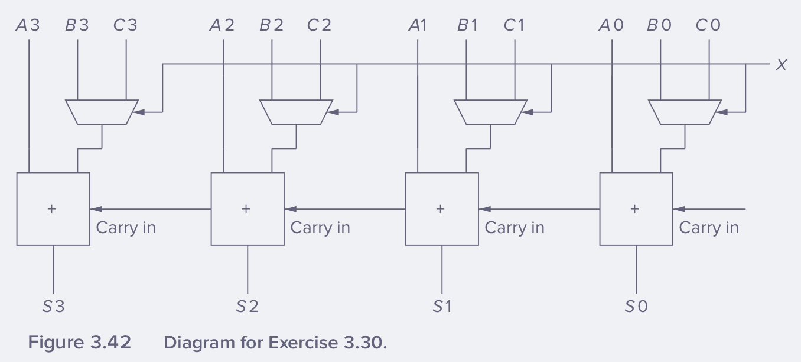

*Ans.-*

---

- 3.32 Recall that the adder was built with individual “**slices**” that produced a sum bit and a carry-out bit based on the two operand bits $A$ and $B$ and the carry-in bit. We called such an element a full adder. Suppose we have a 3-to-8 decoder and two 6-input OR gates, as shown below. Can we connect them so that we have a full adder? If so, please do. (Hint: If an input to an OR gate is not needed, we can simply put an input 0 on it and it will have no effect on anything. For example, see the following figure.)

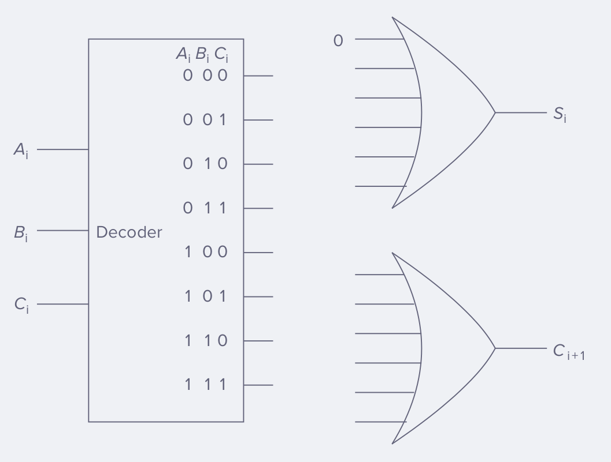

*Ans.-*

---

- 3.34 Having designed a binary adder, you are now ready to design a 2-bit by 2-bit unsigned binary multiplier. The multiplier takes two 2-bit inputs $A[1:0]$ and $B[1:0]$ and produces an output Y, which is the product of $A[1:0]$ and $B[1:0]$. The standard notation for this is: $$ Y = A10 \cdot B10 $$

    - a. What is the maximum value that can be represented in two bits for $A(A[1:0])$?
    - b. What is the maximum value that can be represented in two bits for $B(B[1:0])$?
    - c. What is the maximum possible value of $Y$? d. What is the number of required bits to represent the maximum value of $Y$?
    - e. Write a truth table for the multiplier described above. You will have a four-input truth table with the inputs being $A[1], A[0], B[1]$, and $B[0]$.
    - f. Implement the third bit of output, $Y[2]$ from the truth table using only AND, OR, and NOT gates.

*Ans.-*

---

- 3.36 A comparator circuit has two 1-bit inputs $A$ and $B$ and three 1-bit outputs $G$ (greater), $E$ (Equal), and $L$ (less than). Refer to Figures 3.43 and 3.44 for this problem.
    - a. Draw the truth table for a one-bit comparator.
    - b. Implement $G, E$, and $L$ using AND, OR, and NOT gates. 
    - c. Using the one-bit comparator as a basic building block, construct a four-bit equality checker such that output EQUAL is `1` if $A30 = B30$, `0` otherwise.

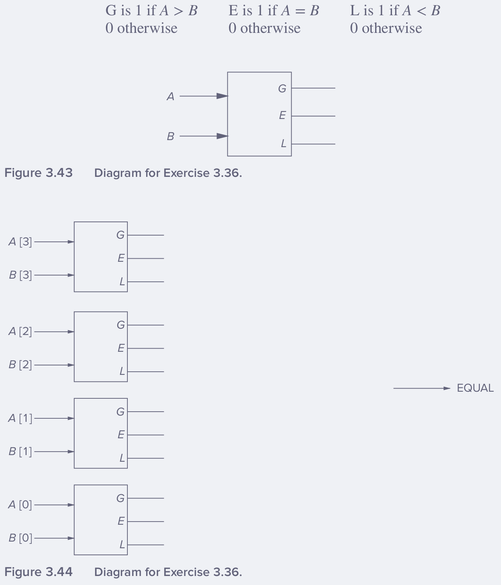

*Ans.-*

- a.
$$
\begin{array}{cc|ccc}
A & B & G & E & L \\
\hline
0 & 0 &   &   &    \\
0 & 1 &   &   &    \\
1 & 0 &   &   &    \\
1 & 1 &   &   &    \\
\end{array}
$$

---

- 3.38 Distinguish between a memory address and the memory’s addressability.

*Ans.-*

---

- 3.40 For the memory shown in Figure 3.45:
    - a. What is the address space?
    - b. What is the addressability?
    - c. What is the data at address 2?

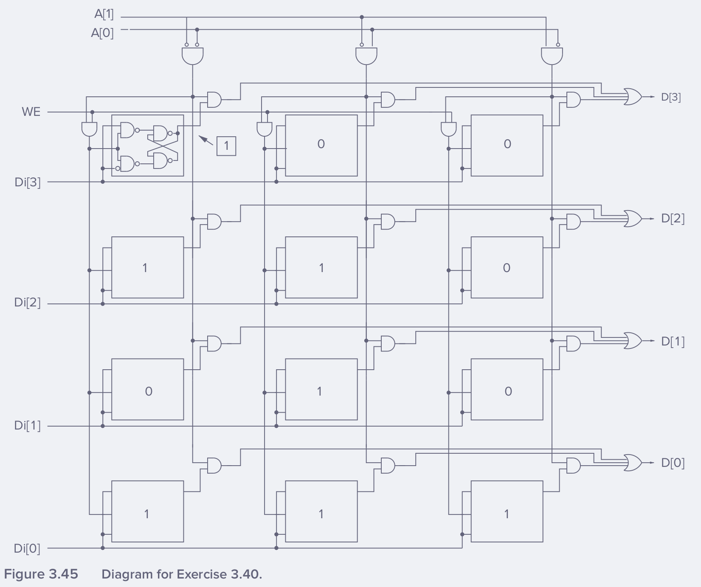

*Ans.-*

---

- 3.42 A combinational logic circuit has two inputs. The values of those two inputs during the past ten cycles were `01`, `10`, `11`, `01`, `10`, `11`, `01`, `10`, `11`, and `01`. The values of these two inputs during the current cycle are `10`. Explain the effect on the current output due to the values of the inputs during the previous ten cycles.

*Ans.-*

---

- 3.44 Recall Section 3.6.2. Can one have an arc from a state where the score is Texas 30, Oklahoma 28 to a state where the score is tied, Texas 30, Oklahoma 30? Draw an example of the scoreboards (like the one in Figure 3.24) for the two states.

*Ans.-*

---

- 3.46 Refer to Section 3.6.2. Draw a partial finite state machine for the game of tic-tac-toe.

*Ans.-*

---

- 3.48 Refer to Figure 3.32. Why are lights 1 and 2 controlled by the output of the OR gate labeled $W$? Why is the next state of storage element 2 controlled by the output of the OR gate labeled $Y$?

*Ans.-*

---

- 3.50 Prove that the NAND gate, by itself, is logically complete (see Section 3.3.5) by constructing a logic circuit that performs the AND function, a logic circuit that performs the NOT function, and a logic circuit that performs the OR function. Use only NAND gates in these three logic circuits.

*Ans.-*

---

- 3.52 A student decided to design a latch as shown below. For what values of $A$ and $B$ will the latch remain in the quiescent state (i.e., its output will not change)?

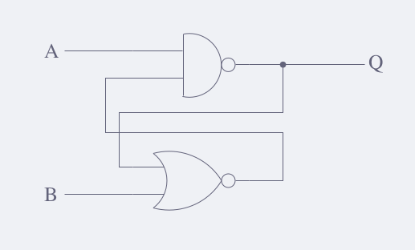

*Ans.-*

---

- 3.54 An 8-to-1 mux (shown below) outputs one of the eight sources, $A, B, C, D, E, F, G, H$ depending on $S[2:0]$, as shown. Note the value of $S[2:0]$ corresponding to each source is shown just below the input to the mux. For example, when $S[2:0] = 001$, $B$ is provided to the output.

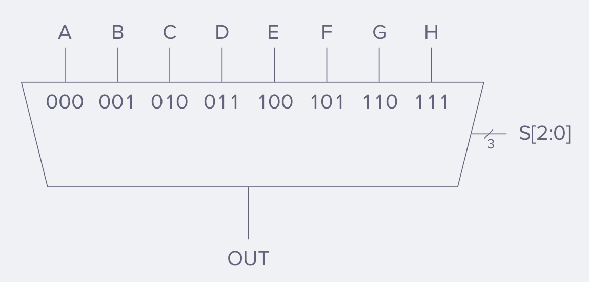

We can implement an 8-to-1 mux with a logic circuit of 2-to-1 muxes, as shown below. In this case, the 0 and 1 below the two inputs to each mux correspond to the value of the select line that will cause that input to be provided to the output of that mux.

- Note that only two of the sources are shown. Note also that none of the select bits are labeled. Your task: Finish the job.
    - a. Label the select line of each mux, according to whether it is $S[2], S[1]$, or $S[0]$.
    - b. Label the remaining six sources to the 2-to-1 mux circuit, so the circuit behaves exactly like the 8-to-1 mux shown above.

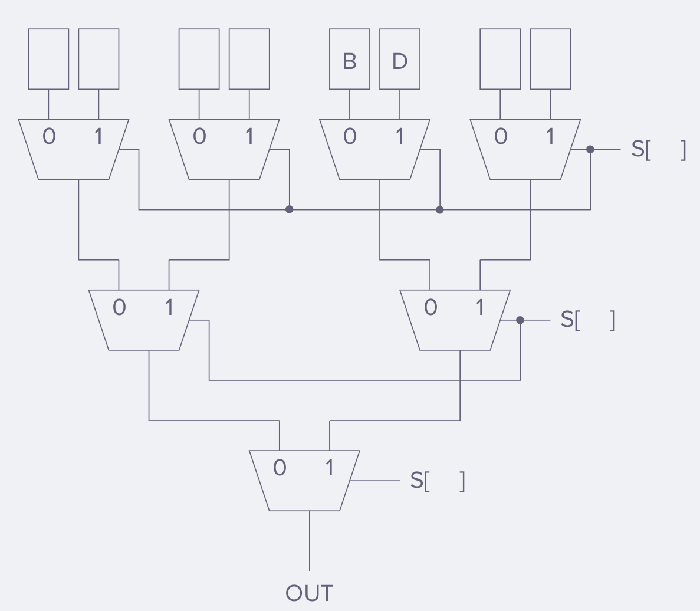

*Ans.-*

---

- 3.56 Shown below is the partially completed state diagram of a finite state machine that takes an input string of H (heads) and T (tails) and produces an output of 1 every time the string `HTHH` occurs.

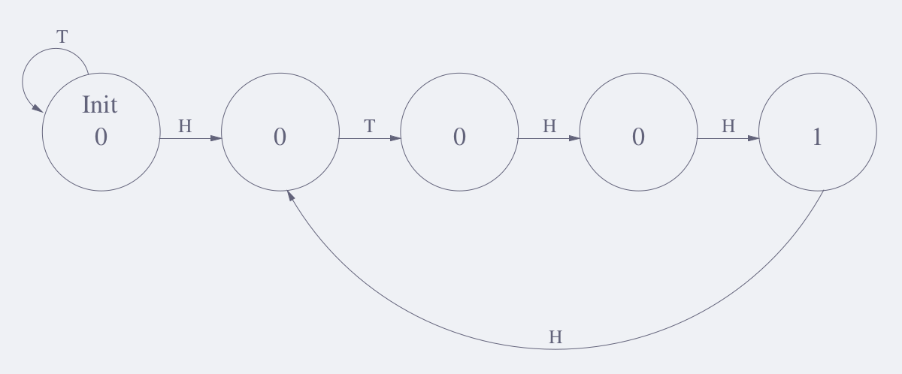

For example: 
```
if the input string is:  H H H H H T H H T H H H H H T H H T
the output would be:     0 0 0 0 0 0 0 1 0 0 1 0 0 0 0 0 1 0
``` 
- Note that the eighth coin toss (`H`) is part of two `HTHH` sequences.
    - a. Complete the state diagram of the finite state machine that will do this for any input sequence of any length.
    - b. If we decide to implement this finite state machine with a sequential logic circuit (similar to the danger sign we designed in class), how many state variables would we need?

*Ans.-*

---

- 3.58 The following transistor circuit produces the accompanying truth table. The inputs to some of the gates of the transistors are not specified. Also, the outputs for some of the input combinations of the truth table are not specified.

Your job: Complete both specifications. That is, all transistors will have their gates properly labeled with either $A, B$, or $C$, and all rows of the truth table will have a 0 or 1 specified as the output.

Note that this is not a problematic circuit. For every input combination, the output is either connected to ground (i.e., $\text{OUT=0}$) or to the positive end of the battery (i.e., $\text{OUT=1}$).

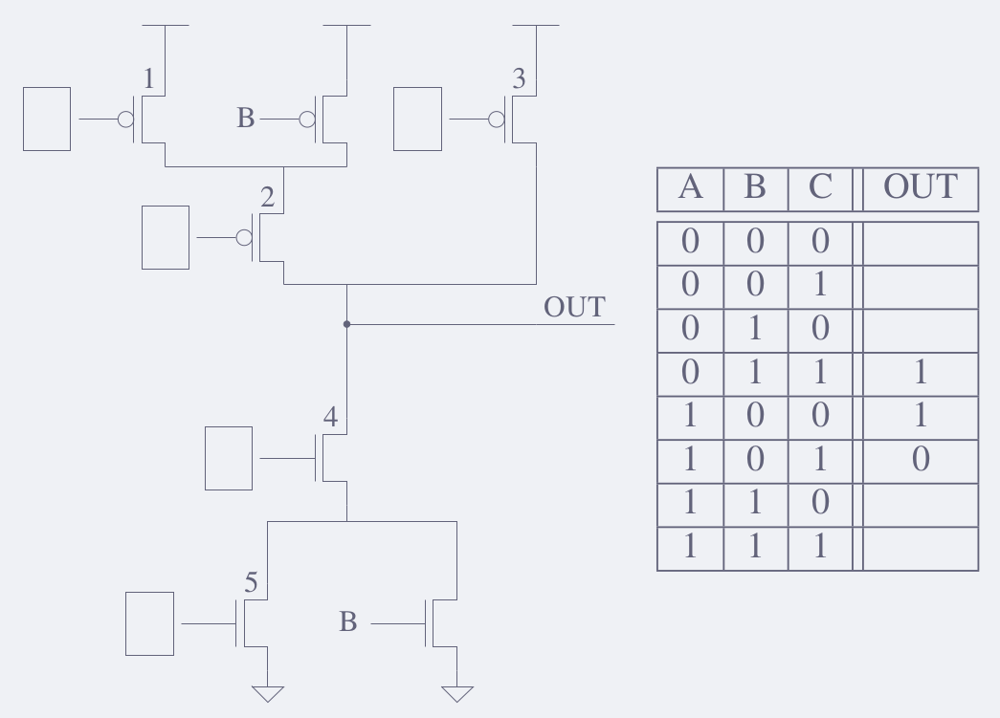

*Ans.-*

$$
\begin{array}{ccc|c}
A & B & C & \text{OUT} \\
\hline
0 & 0 & 0 &  \\
0 & 0 & 1 &  \\
0 & 1 & 0 &  \\
0 & 1 & 1 & 1 \\
1 & 0 & 0 & 1 \\
1 & 0 & 1 & 0 \\
1 & 1 & 0 &  \\
1 & 1 & 1 &  \\
\end{array}
$$

---

- 3.60 A finite state machine is connected to a 23 -by-2-bit memory as shown below:

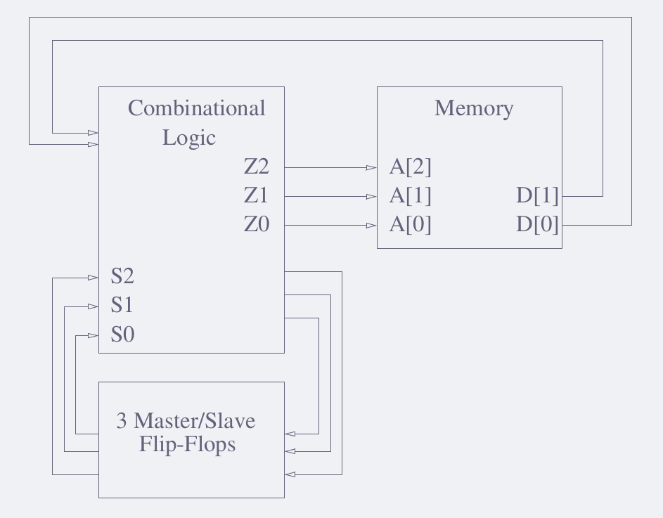

The contents of the memory is shown below to the left. The next state transition table is shown below to the right.

$$
\begin{array}{c|c|||cc|ccc}
\texttt{Address} & \texttt{Content} &   & \texttt{Current State} &   & \texttt{Next State} &   &    \\
A[2:0] & D[1:0] &   & S[2:0] & D[1:0] & D[1:0] & D[1:0] & D[1:0] \\
\hline
\hline
000 & 11 &   & 000 & 001 & 010 & 110 & 100 \\
001 & 10 &   & 001 & 100 & 000 & 011 & 110 \\
010 & 01 &   & 010 & 010 & 100 & 111 & 010 \\
011 & 10 &   & 011 & 001 & 100 & 100 & 010 \\
100 & 01 &   & 100 & 110 & 011 & 001 & 111 \\
101 & 00 &   & 101 & 100 & 010 & 100 & 110 \\
110 & 00 &   & 110 & 001 & 110 & 100 & 010 \\
111 & 01 &   & 111 & 000 & 101 & 111 & 101 
\end{array}
$$

- The output $Z0, Z1, Z2$ is the current state of the finite state machine. That is, $Z0=S0, Z1=S1, Z2=S2$. The cycle time of the finite state machine is long enough so that during a single cycle, the following happens: The output of the finite state machine accesses the memory, and the values supplied by the memory are input to the combinational logic, which determines the next state of the machine.

    - a. Complete the following table.
    - b. What will the state of the FSM be just before the end of cycle 100? Why?

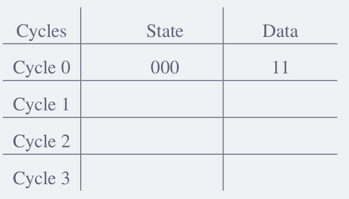

*Ans.-*

---

- 3.62 You are taking three courses, one each in computing (C), engineering (E), and math (M). In each course, you periodically receive assignments. You never receive more than one assignment at a time. You also never receive another assignment in a course if you currently have an assignment in that course that has not been completed. You must procrastinate (i.e., do nothing) unless you have unfinished assignments in both computing and engineering. Design a finite state machine to describe the state of the work you have to do and whether you are working or procrastinating.
    - a. Label each state with the unfinished assignments (with letters C,E,M) for when you are in that state. There are far more states provided than you actually need. Use only what you need.
    - b. There are six inputs: $c, e, m, \overline{c}, \overline{e}, \overline{m}.$ $c, e, m$ refer to you receiving an assignment. $\overline{c}, \overline{e}, \overline{m}$ refer to you completing an assignment. Draw the transition arc for each state/input pair. For example, if you had previously only had an unfinished assignment in math and you received an assignment in computing, you would transition from state M to state CM, as shown below.
    - c. The output of each state is your behavior, 1 if you are working on an assignment, 0 if you are procrastinating. Label the outputs of each state.

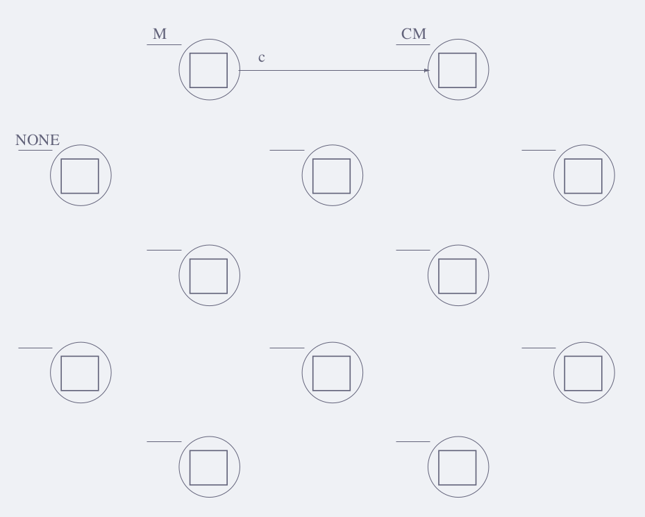

*Ans.-*

---
